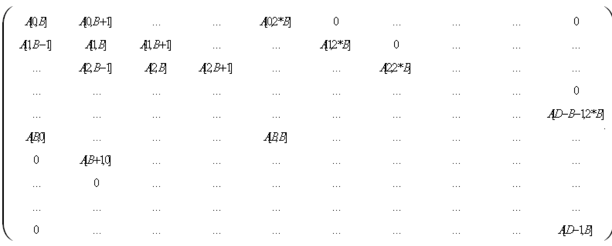

# Notes

Notes

oThis POU requires i\_diDim \* (3 \* i\_diBands + 2) \* SIZEOF(LREAL) bytes of dynamic memory. Therefore, it must be ensured that the parameter LMCx00C\C\Configuration\Program\DynIECDataSize (total available dynamic memory) is set to an adequate value.

oThe correct size of the storage area that the pointers i\_plrMatrix, i\_plrVector and i\_plrSolutionVector are pointing to must be carefully checked. Otherwise, the POU causes memory access errors.

i\_plrMatrix : i\_diDim \* (3 \* i\_diBands + 1) LREALs

i\_plrVector : i\_diDim LREALs

i\_plrSolutionVector : i\_diDim LREALs

oThe functions [FC\_GetMatrixElement()](Functions_A_to_J-68.htm#XREF_D_SE_0087519_1), [FC\_GetVectorElement()](Functions_A_to_J-71.htm#XREF_D_SE_0087525_1), [FC\_SetMatrixElement()](../Functions_K_to_Z/Functions_K_to_Z-62.htm#XREF_D_SE_0087659_1) and [FC\_SetVectorElement()](../Functions_K_to_Z/Functions_K_to_Z-63.htm#XREF_D_SE_0087661_1) are available for allocating and reading the elements of the matrix and the vectors involved. With this POU, the column value i\_diNumCols = 3 \* i\_diBands + 1 must be set for the allocation of the matrix.

oThe allocation of the matrix elements to the elements of the array A, which this represents, elements is as follows (D = i\_diDim, B = i\_diBands has been set for a shorter notation):

Allocation of the elements of a band matrix to the elements of the array of the band matrix POU

Visualization using the band matrix above as an example.

diDim : DINT := 10;   
diBands : DINT := 2;   
diCols : DINT := 7;   
alrA : ARRAY[0..9,0..6] OF LREAL;   
alrB : ARRAY[0..9] OF LREAL := 10(2.0);  (\* Beispiel für "rechte Seite" \*)  
alrX : ARRAY[0..9] OF LREAL;   
etDiag : PD\_GlobalDiagnostic.ET\_Diag;  
etDiagExt : PD\_PacDriveLib.ET\_DiagExt;

Allocation of the matrix:

FOR i := 0 TO (diDim - 1) DO   
   FOR j := 0 TO (3 \* diBands) DO   
      FC\_SetMatrixElement(  
         i\_plrMatrixStart:=ADR(alrA[0,0]),   
         i\_diNumCols:=diCols,   
         i\_diRow:=i,   
         i\_diCol:=j,   
         i\_lrValue:=0.0);   
   END\_FOR   
END\_FOR   
FOR i := 0 TO (diDim - 1) DO   
   FC\_SetMatrixElement(  
      i\_plrMatrixStart:=ADR(alrA[0,0]),   
      i\_diNumCols:=diCols,   
      i\_diRow:=i,   
      i\_diCol:=diBands,   
      i\_lrValue:=1.0);   
END\_FOR   
FOR i := 1 TO (diDim - 1) DO   
   FC\_SetMatrixElement(  
      i\_plrMatrixStart:=ADR(alrA[0,0]),   
      i\_diNumCols:=diCols,   
      i\_diRow:=i,   
      i\_diCol:=diBands-1,   
      i\_lrValue:=0.5);   
END\_FOR   
FOR i := 0 TO (diDim - 2) DO   
   FC\_SetMatrixElement(  
      i\_plrMatrixStart:=ADR(alrA[0,0]),   
      i\_diNumCols:=diCols,   
      i\_diRow:=i,   
      i\_diCol:=diBands+1,   
      i\_lrValue:=0.5);   
END\_FOR   
FOR i := 0 TO (diDim - 3) DO   
   FC\_SetMatrixElement(  
      i\_plrMatrixStart:=ADR(alrA[0,0]),   
      i\_diNumCols:=diCols,   
      i\_diRow:=i,   
      i\_diCol:=diBands+2,   
      i\_lrValue:=1.0/3.0);   
END\_FOR

FC call-up:

FC\_BandAlgorithm (   
   i\_diDim := diDim,   
   i\_diBands := diBands,   
   i\_lrZeroLimit := 1E-12,   
   i\_plrMatrix := ADR(alrA[0,0]),   
   i\_plrVector := ADR(alrB[0,0]),   
   i\_plrSolutionVector := ADR(alrX[0,0]),   
   q\_etDiag => etDiag,   
   q\_etDiagExt => etDiagExt );

After calling up the function, the solution of the equation system is available in array alrX.