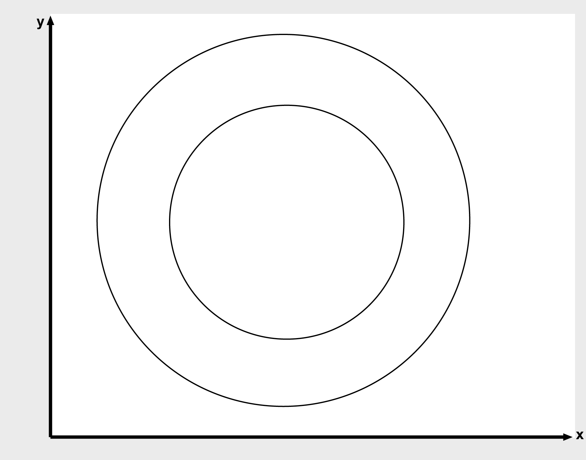
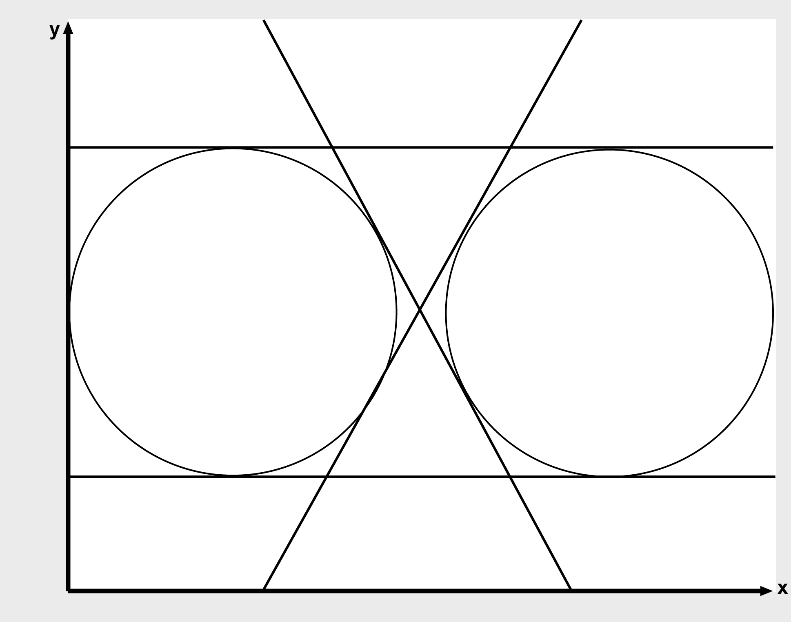

# Description

Description

Calculates the common tangents of the circles i\_stCircle1 and i\_stCircle2. There are several options here:

oThere exists no common tangent.

oThere exists one common tangent.

oThere exist two common tangents.

oThere are three common tangents.

oThere exist four common tangents.

oThere exists an infinite number of common tangents (the circles coincide).

The following figures illustrate the various different cases.

No common tangents

One common tangent

Two common tangents

Three common tangents

Four common tangents

