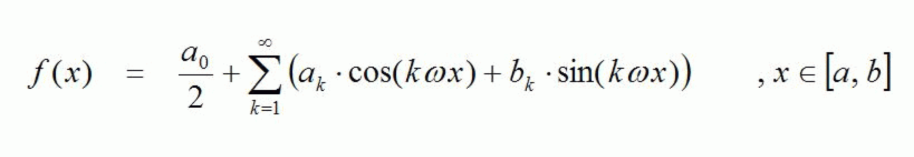
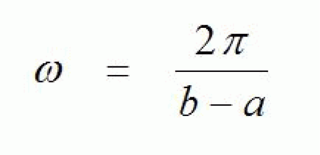
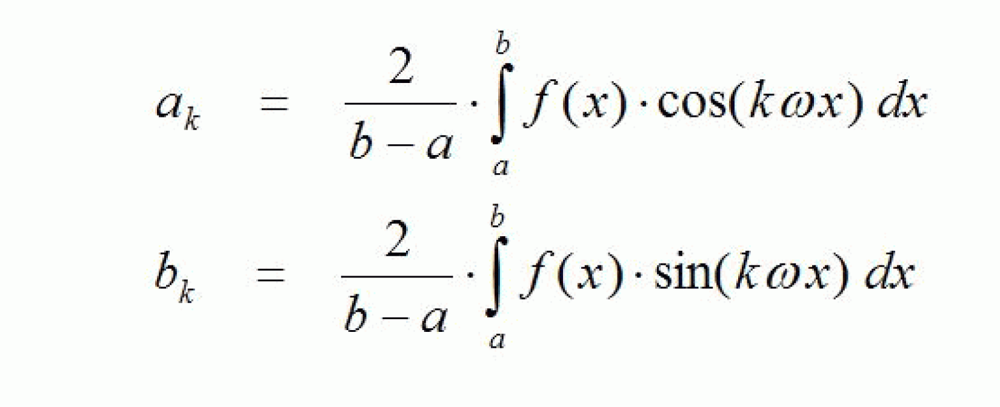

# Description

Description

A periodic function f which is defined on an interval [a, b] can be represented as a Fourier series under suitable conditions:

Here, the Fourier coefficients ak and bk are provided by:

The function FC\_FourierCoefficients calculates the Fourier coefficients defined above up to index k = i\_diMaxIndex ("k-th harmonic"). The calculated Fourier coefficients are entered into arrays whose start will be communicated to the function by means of the pointers i\_plrFou­rierCoefficientsA (Array for ak) and i\_plrFourierCoefficientsB (Array for bk).

The function f is transferred by a value table. As a definition range the interval 0.0 ... i\_lrXPeriod is assumed. i\_diNumberOfIntervals contains the length of the value table (number of partial intervals, into which the definition range [0.0, i\_lrXPeriod] is split.

The calculated Fourier coefficients are used by the function [FC\_FourierPartialSum](Functions_A_to_J-63.htm#XREF_D_SE_0087509_1) to calculate finite Fourier partial sums. A possible use is the blanking of higher harmonics (filtering).