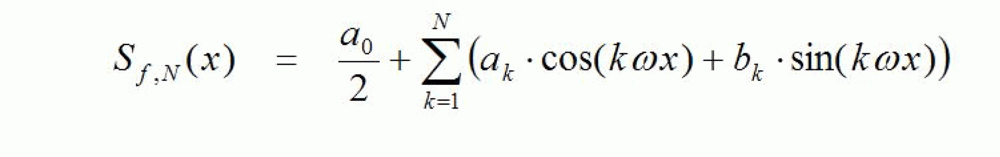

# Description

Description

This calculates the value of a finite Fourier partial sum. The requirement for this is that first the Fourier coefficients have been calculated up to a sufficiently large index, using the function [FC\_FourierCoefficients](Functions_A_to_J-62.htm#XREF_D_SE_0087507_1).

The Fourier partial sum for function f up to the index N has the following form (with regard to the definition of the Fourier coefficients see [FC\_FourierCoefficients](Functions_A_to_J-62.htm#XREF_D_SE_0087507_1)):

Under suitable preconditions for the function f, S f, N approximates the latter as well as required for a sufficiently large N.