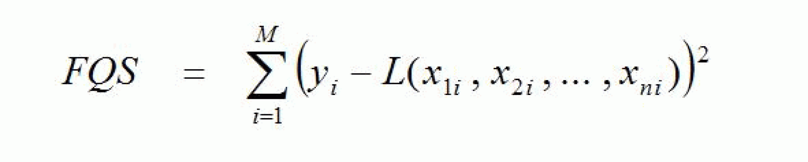
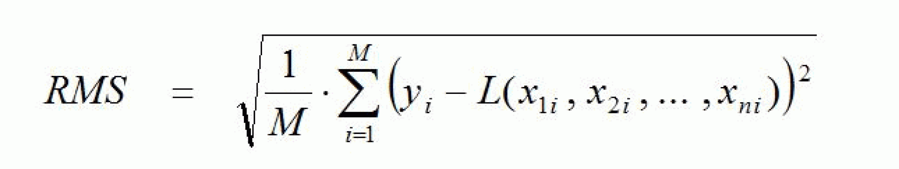

# Description

Description

It is the general task of the regression analysis to calculate from a set of measured values which a linear interrelationship is detected or suspected, those linear functions which best approximate these measured values. The best approximation is understood to be that linear function whose error square sum relative to the measured values is minimal. The proportionality factors which occur in these linear functions are designated as regression coefficients. If the measured values are value pairs

(xi , yi ) ; i = 1, ... , M

then the approximating linear function is designated a regression line. If it is (n+1)-Tuple (n > 1)

(x1i , x2i , ... , xni , yi ) ; i = 1, ... , M

then it is designated as a regression plane. Here, M designates the number of measurements.

The different identifier x and y can be traced back to the fact that in practice there are as a rule one dependent quantity (y) and one or several independent quantities (x).

It is thus the task of the linear regression to determine a linear function

y = L (x1 , x2 , ... , xn)

so that the error square sum

becomes minimal. Here, the function L has the form

L (x1 , x2 , ... , xn) = k0 + k1 \* x1 + ... + kn \* xn

The constants k0 , ... , kn are the above-mentioned regression coefficients which are to be calculated.

The following figure shows an example of a regression line:

As a measure for the scattering of the measured values around the determined regression function, the root mean square error (RMS) may be used. This is defined as

