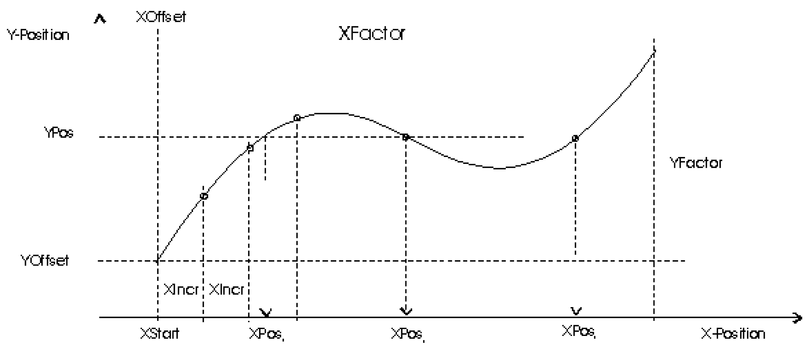

# Example

Example

Cam with three X positions for one Y position

Example for finding multiple solutions:

lrXStart := lrXOffset;  
i := 0;  
  
WHILE lrXStart + lrXIncr < lrXOffset + lrXFactor DO  
  
FC\_ProfileInvCompute(i\_diProfileId := diProfileId,   
i\_lrYPos := lrYPos,   
i\_lrXOffset := lrXOffset,   
i\_lrYOffset := lrYOffset,   
i\_lrXFactor := lrXFactor,   
i\_lrYFactor := lrYFactor,   
i\_lrXStart := lrXStart,   
i\_lrXIncr := lrXIncr,   
i\_lrAccuracy := lrAccuracy,   
q\_etDiag : etDiag,   
q\_etDiagExt : etDiagExt,   
q\_lrXPos := lrXPos);   
  
IF etDiag <> Ok THEN   
EXIT;   
END\_IF   
  
alrXPos[i]:= lrXPos; (\* save result \*)   
i := i + 1; (\* number of valid results \*)   
  
lrXStart := lrXPos + lrXIncr / 2.0; (\*Start of next search \*)   
END\_WHILE