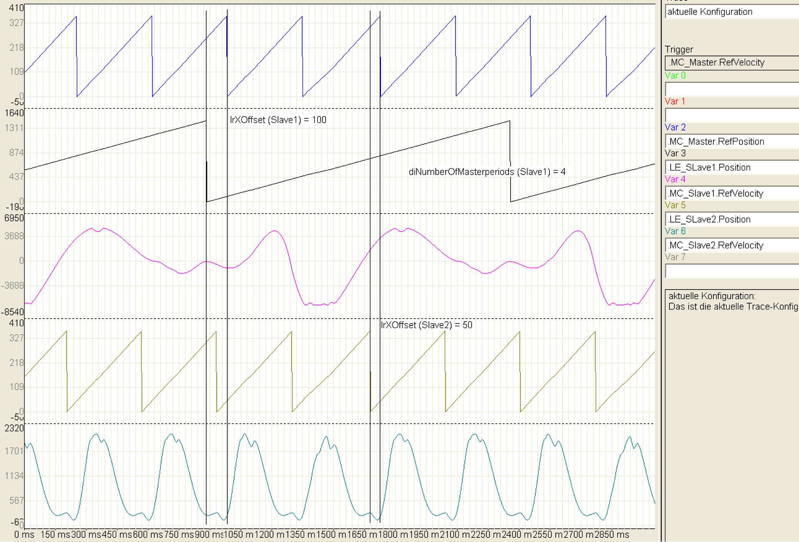

# Structure Elements

Structure Elements

| Variable | Data type | Description |
| --- | --- | --- |
| diProfileId | DINT | Profile Id of the active cam.  If the active cam should be switched during the run, the profile Id of the new cam is simply applied. The function block assumes then that the new curve is active with the beginning of the next master period. |
| lrYFactor | LREAL | Y scaling of the active curve. |
| lrXOffset | LREAL | n some applications, the X-area of the profile used are displaced in comparison to the virtual master axes (Intelligent Line Shaft) and therefore, the 0° position of the ILS does not correspond to the value of the profile at the position 0°. The displacement must be reported to the ILS via the lrXOffset parameter.  Example: X-area of the virtual master axes (ILS) and the profile = 0.0° … 360.0°  0° of the master axis corresponds to the X value 90° of the profile -> .lrXOffset := 90.0;  In this setting, if the setting of the X position of the ILS = 0°, then it calculates using the value profile(90°), if it is 90°, then it calculates using Profile(180°), etc.  The lrXOffsets of the profile may differ in comparison to the master axes so that these have to be set separately for all slave axis and modified for the runtime. |
| diNumberOfMasterPeriods | DINT | In some application cases the X-periods of the slave profiles are an integral multiple of the master period. This integral multiple must be communicated to the ILS using the parameter diNumberOfMasterPeriods. |
| diMasterPeriodInit | DINT | If the parameter diNumberOfMasterPeriods >1, then - at the first start after Enable = TRUE - ILS must be informed in which master period the slave axis is located. |

NOTE: The take over of a modified profile on the 0 position of the master axes. Faulty motion of the slave axis possible when using lrXOffset. Switch the profile for the slave axes coordinates for the master axes position.

Example for using the variables diNumberOfMasterPeriods and diMasterPeriodInit

