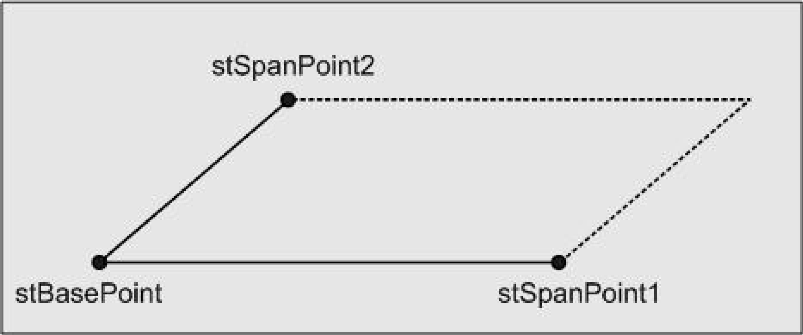

# Description

Description

This data structure defines a parallelogram in 2-dimensional space. The parallelogram is defined by specifying the position vectors of three points.

The meaning of these points can be taken from the following figure:

