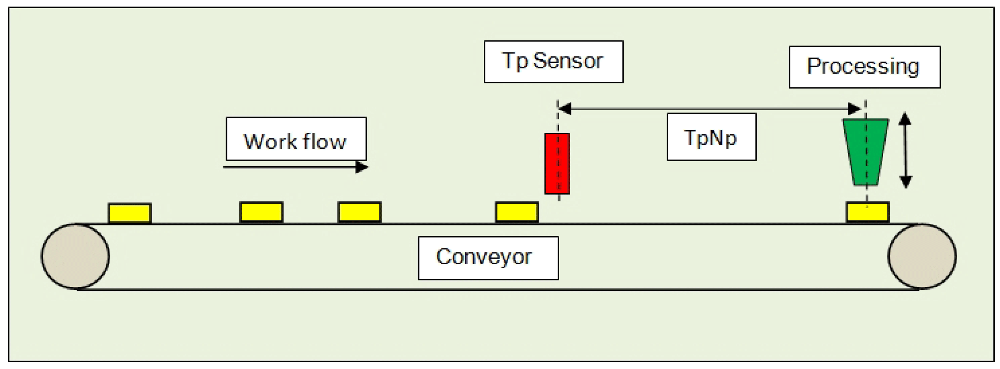

# Schematic view of the mechanics

Schematic view of the mechanics

A belt conveys products under a processing station. During processing the feed is in standstill. The processing itself is usually a simple actuator, which is controlled via a signal and either delivers a completion notification over a period or via a contact.

The position is collected via a sensor and the POU FB\_TpDistanceControl. The distances can thereby vary heavily. Up to 16 products ([Gc\_diMaxNumberOfElementsInFiFo](../Global_Elements/Global_Elements-3.htm#XREF_D_SE_0087808_1)) can be between the Touchprobe sensor and the processing station. As the products must be under the tools for processing, the feed is executed via a positioning POU.