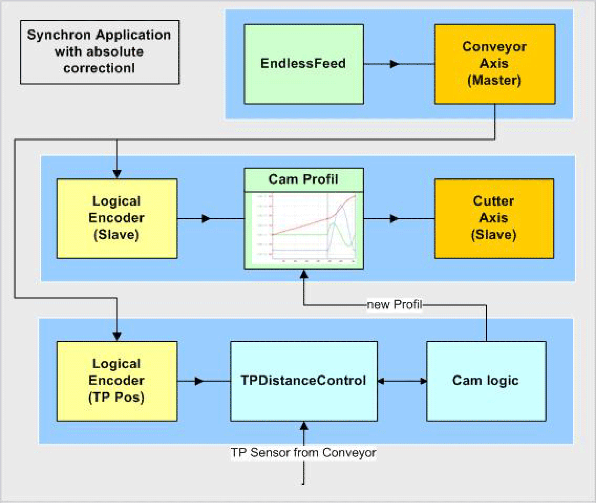

# Logical connection of the axes and logical encoder

Logical connection of the axes and logical encoder

The conveyor belt is the master in this network The velocity and position serve as guide value for the knife and the print mark control.

The knife is connected with the master encoder via a Cam function (MultiCam).

The Touchprobe sensor is installed over the conveyor belt and detects the passing parts. The POU FB\_TpDistanceControl measures the distance of the parts. Up to 16 parts are saved in a FiFo. FB\_TpDistanceControl has its own logic encoder, which is also connected to the master.

The Cam Logic calculates the respective CAM profiles and supplies them to the MultiCam.