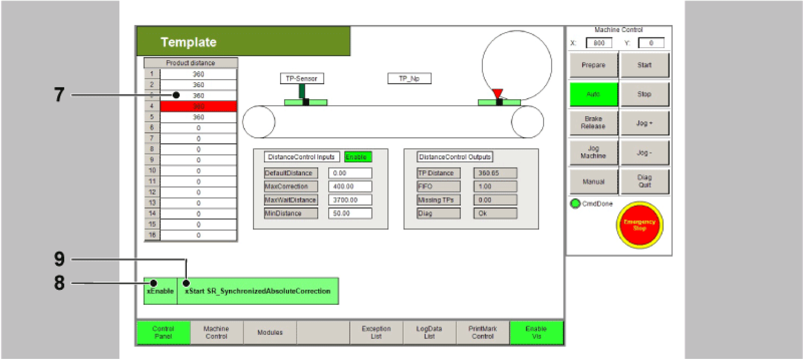

# Control of the Equipment Module in the Template Visualization

Control of the Equipment Module in the Template Visualization

The equipment module PrintMarkControlExample can be controlled in the template visualization under the sub-point Printmark Control.

To do this, connect with the controller via the Logic Builder, transfer the demo project PrintMark­ControlExample to the controller and start.

In the template, first start the mode Prepare, and then the mode Auto as instructed below:

| Step | Action |
| --- | --- |
| 1 | Via the button Enable Vis, activate the visualization (point 1). |
| 2 | Via the button Control Panel, switch to the Control Panel (point 2). |
| 3 | Via the button Prepare, select the mode Prepare (point 3). |
| 4 | Via the button Start, start the mode Prepare (point 4). |
| 5 | Via the button Auto, switch to the mode Auto (point 5). |
| 6 | Via the button Start, start the mode Auto (point 6).  G-SE-0068912.1.gif-high.gif |
| 7 | Next, the distances of the Touchprobe events can be adjusted in the table (point 7).  The distances of the Touchprobe events are required for the Touchprobe simulation. They require a connection between CN2.9 and CN4.9.  Alternatively a sensor at the Touchprobe input can be used. This leads to the products no longer being displayed properly in the visualization. |
| 8 | Thereafter use the button xEnable to activate the equipment module (point 8). |
| 9 | Finally, set a xStart signal via the visualization (point 9). |

NOTE: The Touchprobe simulation requires a connection between CN2.9 and CN4.9.

All variables and POUs relevant to the print mark control are initialized in the action Init\_PrintMark­Correction. Here, the data on the print mark control can be adjusted to the products and the print mark distances. If a real Touchprobe is to be used, this can also be adjusted here.