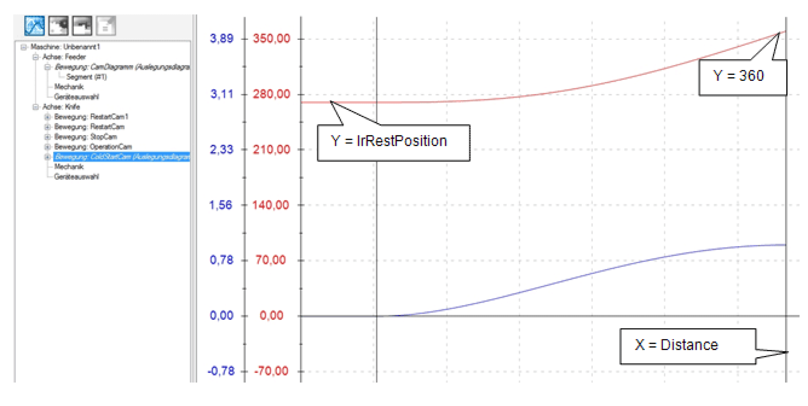
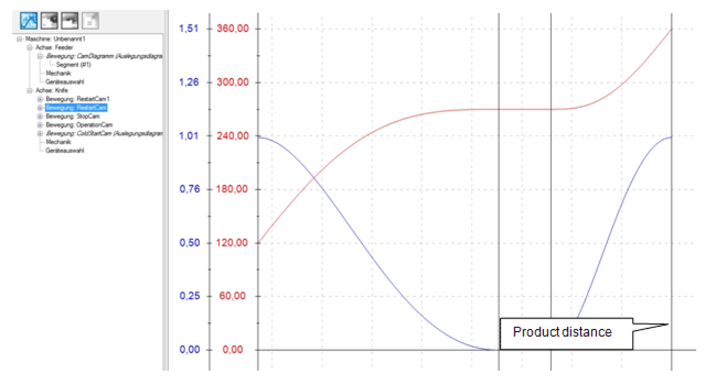

# Command table

Command table

In the operation mode Automatic the OpMode CamCS is selected for this module.

The logic of the equipment modules assumes that the knife is in the rest position.

At first, the Touchprobe is waited for. A ColdStartCam is activated in the MultiCam. The Y axis (knife) moves from the rest position (270) up to the cutting position (360). The X axis (Master LEnc) moves from zero up to the distance between Touchprobe sensor and intersection.

Motion ColdStartCam

The MultiCam is started in PDL.ET\_MultiCamCSModeMaster = 2 / SetMasterPositionToMinusIn­finite. This sets the master encoder to a very high negative value. Consequently the ColdstartCam is active in the lower range and the knife is waiting in the rest position. With the first Touchprobe signal, the master encoder position is then set to zero using a SetPos command, which leads to the master encoding position moving into the upper range of the cam and the knife starting to move to the cutting position.

At the end of ColdStartCam, it is checked whether a further product has been recognized at TpDistanceControl. This applies in most cases, if the distance TpNp is large enough.

If a part has been recognized, an OperationCam is loaded in the MultiCam and started. The measured product distance is entered into the OperationCam as end point of the X axis. This is then started with the signal xNewCam.

Motion OperationCam

If no further product has been recognized before the end of the ColdStartCam, a StopCam is connected. It moves the knife to the rest position. If a product is recognized while this StopCam is active, it is interrupted with the signal xInstantNewCam and the RestartCam is started.

This can lead to three cases:

| Step | Action |
| --- | --- |
| 1 | The next product is recognized in the synchronization phase of the StopCam. Then a normal OperationCam follows, as both cams are identical in the synchronization phase. |
| 2 | The next product is recognized outside of the synchronization phase and the measured part distance is larger than the required minimum distance (lrXStartDistance + lrStopDistance + 1.0). Then a RestartCam is started and the rest position is moved to. |
| 3 | The next product is recognized outside of the synchronization phase and the measured part distance is smaller than the required minimum distance (lrXStartDistance + lrStopDistance + 1.0). Then a RestartCam is started without moving to the rest position. |

Motion RestartCam

If no new product is recognized during the entire StopCam, the logic branches back to the start and again waits for the first Touchprobe.