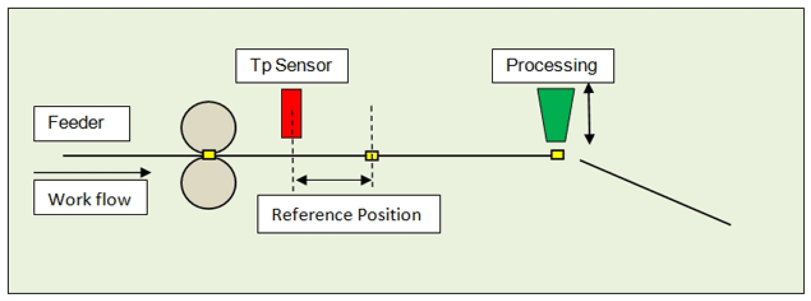

# Schematic view of the mechanics

Schematic view of the mechanics

A pair of roller conveys, for example, a foil under the processing station. During processing the feed is in standstill. The processing itself is usually a simple actuator, which is controlled via a signal and either delivers a completion notification over a period or via a contact.

Only the Touchprobe position is compared with a reference position. The reference position must be in the range > 0 and < length of parts. If the reference position is near its value range boundary, a measured value may refer to a period before or after the current period. But this is identified in the function block and it is allocated to the correct period.