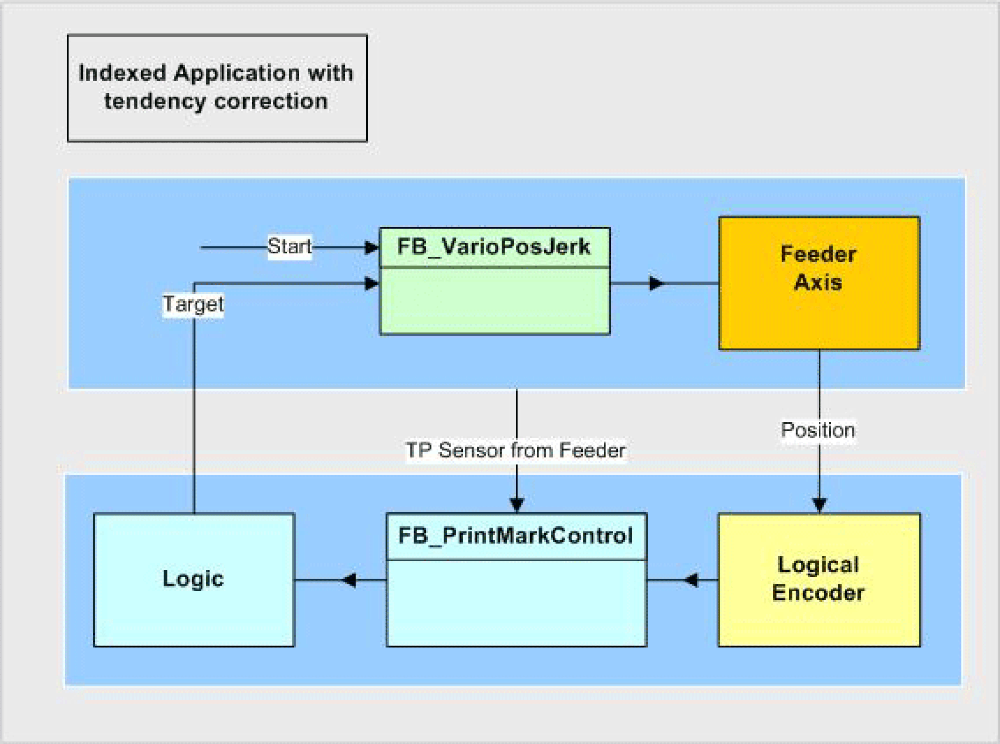

# Logical connection of the axes and logical encoder

Logical connection of the axes and logical encoder

To measure the feed position a logical encoder is used. This is only necessary, as the POU [FB\_PrintMarkControl](../Function_Blocks_I_to_Q/Function_Blocks_I_to_Q-29.htm#XREF_D_SE_0087332_1) cannot be directly connected to an axis.

The Touchprobe sensor is installed over the conveyor belt and detects the passing print marks. FB\_PrintMarkControl compares the position of the logical encoder at the time of the Touchprobe signal with a reference position, and calculates its deviation. If the measured position is outside of a defined window, the output q\_xNoValidTp is set. But the output q\_diNumberOfTps is increased further.

The logic of the example program calculates a new distance, if a valid Touchprobe was recognized. Otherwise the default length is used as distance for the following positioning.