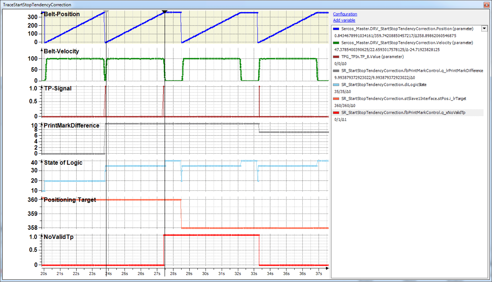

# Traces

Traces

The following Trace shows a situation where a Touchprobe is outside of the window.

The function block indicates via q\_xNoValidTp that a Touchprobe was identified outside of the window and then uses the default length of 360 units (see cursor position).

The following Trace shows a situation with a relatively large Touchprobe deviation, but still within the window.

The deviation of approx. 5 units can be identified at the cursor position. The correction is only approx. 1 unit, however.

