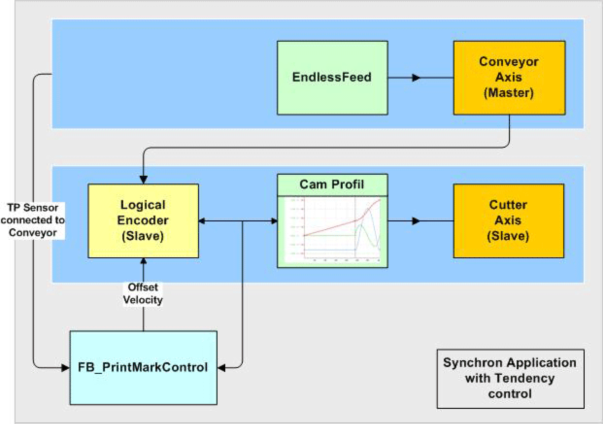

# Logical connection of the axes and logical encoder

Logical connection of the axes and logical encoder

The conveyor belt is the master in this network The velocity and the position serve as master value for the knife.

The knife is connected with the master encoder via a Cam function (MultiCam).

The Touchprobe sensor is installed over the conveyor belt and detects the passing print marks. The POU [FB\_PrintMarkControl](../Function_Blocks_I_to_Q/Function_Blocks_I_to_Q-29.htm#XREF_D_SE_0087332_1) compares the position of the logical encoder of the slave at the time of the Touchprobe signal with a reference position and calculates the correction velocity, which in turn is fed to the logical encoder of the slave as OffsetVelocity.