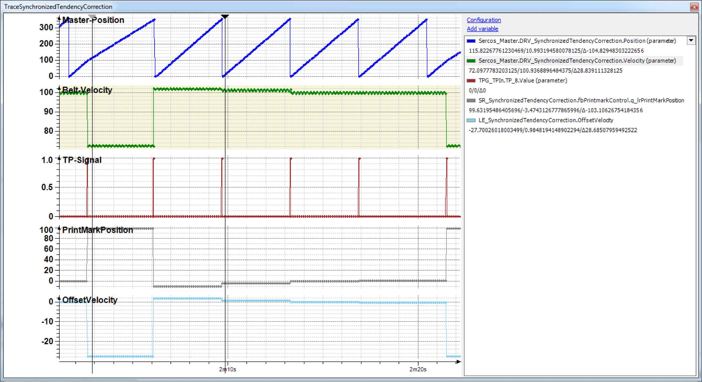

# Trace

Trace

The Trace shows the situation with a relatively large Touchprobe deviation within the window.

The OffsetVelocity (light-blue) is visible on the left cursor position. This velocity leads to a velocity change of the physical axis (green). At the right cursor position the position deviation of the print mark is now only 3.5 increments (grey).

