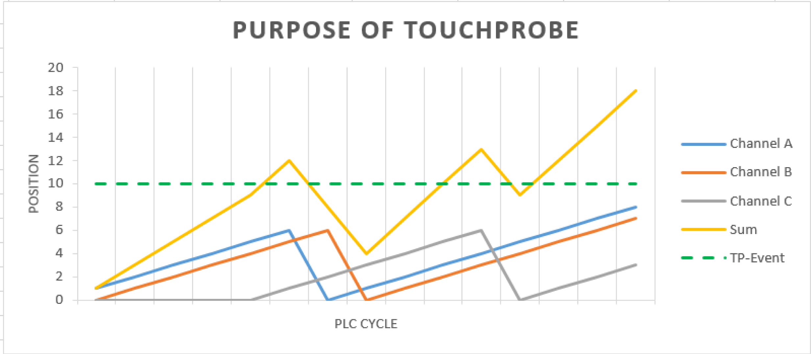

# Using Touchprobes

Using Touchprobes

The SoMotionGenerator offers the possibility to assign position values to one of the channels.

The curves of the certain channels could be defined with a jump of the position. If those jumps are occuring during a short time (a single PLC cycle) in several channels, the possibility to assign the Touchprobe event to a certain position of the slave axis is getting lost.

The following graphic displays this circumstance. This example shows the five possible occurences of the Touchprobe signal (Touchprobe event) on the curve of the slave axis (sum).

The SoMotionGenerator offers the possibility to assign the measured value at a Touchprobe event to a channel. Therefore, it is possible to restore the unambiguous position of the slave axis from the channel position.

NOTE: Internally, an auxiliary position value (ST\_TouchProbe.lrPosition) will be created which follows the assigned channel. The behavior of this position is similiar to a position of a logical encoder.