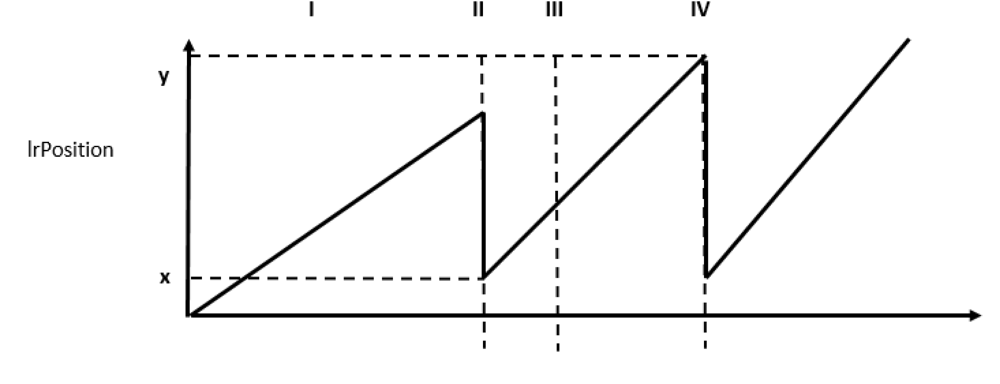
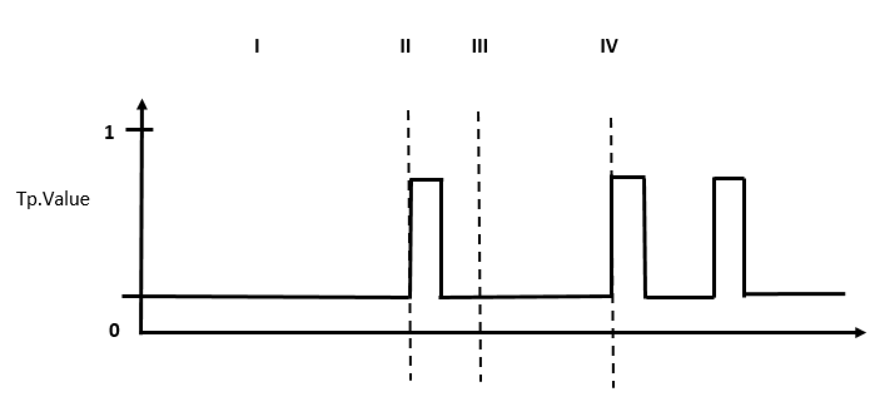
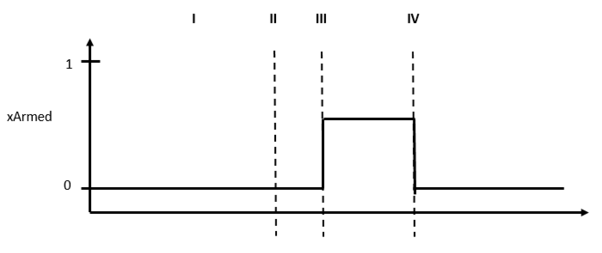
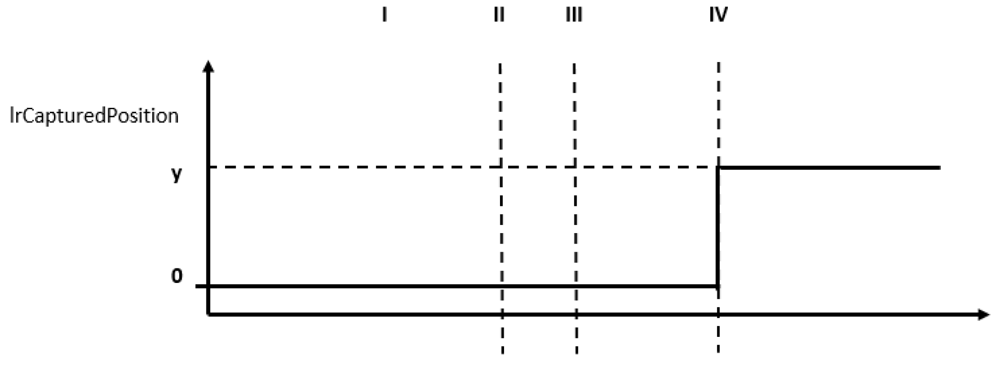

# Examples

Examples

The following examples show the use of the Touchprobe in combination with the FB\_SoMotion­Generator. Initially, the diagrams show the timing behavior of the involved signals.

 Afterwards, a detailed description is provided of the certain event times (I-IV) to handle the SoMotionGenerator Touchprobe.

The graphic, etPositionSource, shows the curve of the position adjusted in the ST\_Touchprobe.etPositionSource (usually a channel is used for this kind of application).

The graphic, lrPosition, shows the behavior of the auxiliary position in the ST\_TouchProbe.lrPosition described in the overview.

The graphic, Tp.Value, shows the assumed course of the Touchprobe signal.

The graphic, xArmed, shows the assumed course of the ST\_Touchprobe.xArmed. The signal displays an active Touchprobe.

The graphic, xCaptureOk, shows the valid detection of the Touchprobe signal.

The graphic, lrCapturedPosition, shows the position at the time of the valid detection of the Touchprobe signal.

| Event | Description |
| --- | --- |
| n/a | Before the Touchprobe functionality of the SoMotionGenerator can be used, connect the parameter ST\_Touchprobe.ifTouchProbe to the Touchprobe input where the sensor is connected.  Select the parameter ST\_Touchprobe.etPositionSource to the position of where to execute the Touchprobe. |
| I | After these two parameters are set, the parameter ST\_TouchProbe.lrPosition (of the SoMotionGenerator) will follow the position of the selected position source without corresponding to the set position on the source.  The functionality of lrPosition works identically to the functionality of a logical encoder. |
| II | The Touchprobe is now able to capture the value of the lrPosition parameter at the time of the Touchprobe event. The value of ST\_TouchProbe.lrPosition does not correspond to the machine coordinate system because the parameter ST\_TouchProbe.lrPosition ignores the set position on the source.  Define a set position on lrPosiiton with the parameters ST\_TouchProbe.etSetPosMode and ST\_TouchProbe.lrSetPosValue to home the lrPosition parameter.  Execute the set position by setting the parameter ST\_TouchProbe.xDoSetpos to true. |
| III | Select the edge of the Touchprobe with the parameter ST\_TouchProbe.etEdge to activate the Touchprobe functionality.  Activate the Touchprobe by setting the parameter ST\_TouchProbe.xArm to true. |
| n/a | The SoMotionGenerator sets the parameter ST\_TouchProbe.xArmed to true which signals that the user is waiting for the sensor edge. |
| IV | The SoMotionGenerator signals a found edge with the parameter ST\_TouchProbe.xCaptureOk = TRUE.  At this point, the SoMotionGenerator has updated the parameter ST\_TouchProbe.lrCapturedPosition with the position the parameter ST\_TouchProbe.lrPosition had at the time when the edge was seen on the sensor.  (The SoMotionGenerator interpolates the position change between two cycles to get the accurate position). |
| n/a | The user takes the Touchprobe result from the parameter, ST\_TouchProbe.lrCapturedPosition.  The user can start a new capturing by returning to event two (II) or event three (III), if the user needs to recalibrate the lrPosition value again. |