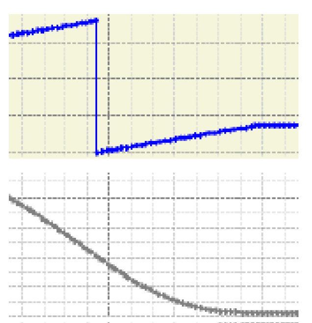

# Example:

Example:

PDL.ST\_MultiCam stMultiCam;  
stMultiCam,diNumberOfCamPoints := 2;  
stMultiCam.astCamPoint[0].lrX := 0.0;  
stMultiCam.astCamPoint[0].lrY := 23.0;  
stMultiCam.astCamPoint[0].etCamType := PDL.ET\_CamType.Straight;  
stMultiCam.astCamPoint[1].lrX := 180.0;  
stMultiCam.astCamPoint[1].lrY := 100.0;  
stMultiCam.astCamPoint[2].lrM := 1.0;  
stMultiCam.astCamPoint[2].lrK := 0.0;  
stMultiCam.astCamPoint[1].etCamType := PDL.ET\_CamType.Poly5Com;  
stMultiCam.astCamPoint[2].lrX := 360.0;  
stMultiCam.astCamPoint[2].lrY := 23.0;  
stMultiCam.astCamPoint[2].lrM := 0.0;  
stMultiCam.astCamPoint[2].lrK := 0.0;  
  
SMG.ST\_MotionJob stMotionJob;  
stMotionJob.etJobType := SMG.ET\_MotionJobType.MultiCam;  
stMotionJob.stCam.rstMultiCam REF=m\_stMultiCam;  
  
SMG.FB\_SoMotionGenerator fbSoMG;  
fbSoMG.TakeJob(i\_etChannel := SMG.ET\_Channel.A, iq\_stMotionJob := stMotionJob);

Here is a multi-cam over three points (two segments) on the right corresponding path. The blue trace is the master (in endless mode [0;360]), in grey the slave position.

n in case of a multi-cam

