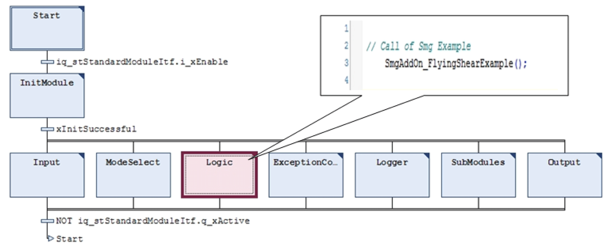

# Calls

Calls

Call up of the function block FB\_SmgAddOnModule

The call up of the AxisModule and the FB\_SmgAddOnModule takes place in the action SubModules of the equipment module SR\_SmgAddOnModule.

Call up of the application example

The call up of the application example is performed in the action Logic of the equipment module SR\_SmgAddOnModule.

As example a flying saw was implemented here:

