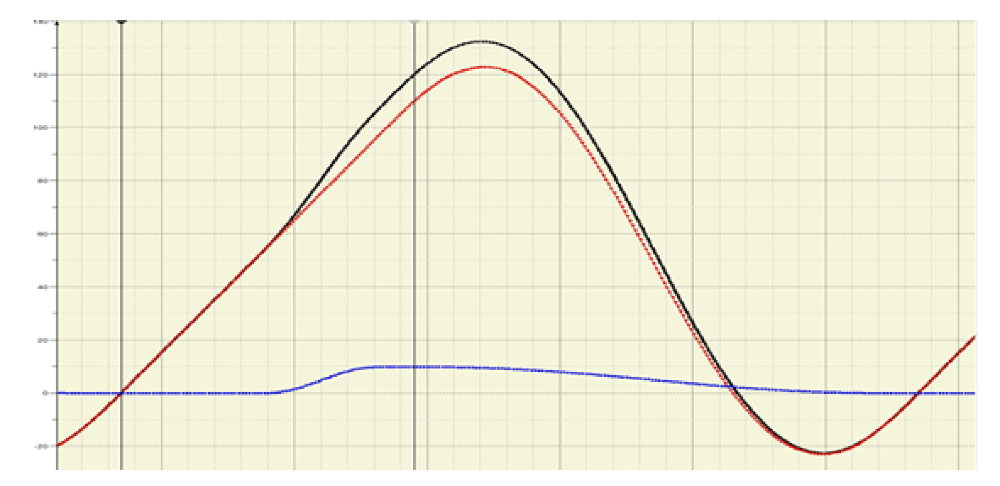

# Description

Description

The application example with a simple flying saw was realized. A knife will run synchronously to the product during the cut.

To avoid that the knife gets jammed when it comes out of the material, an offset motion will overlie the synchronous motion.

The normal synchronous motion is realized through a cam function on channel A. Then, the offset motion is also performed as a cam function on channel B.

The example describes only the synchronous movement of the knife to the product. The up-and-down movement (cutting) of the knife is not described. In the example, the mentioned up-and-down movement is only simulated by the visualization.

Reference values from channel A and B as well as the reference value of the axis.

|  |  |
| --- | --- |
| Red cam | Reference value from channel A |
| Blue cam | Reference value from channel B |
| Black cam | Reference value of the axis = Sum from the channels A + B |