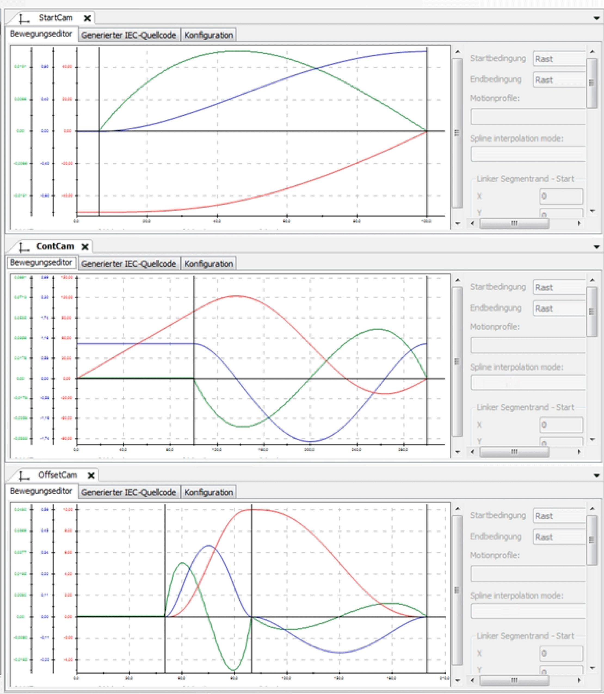

# Cam Diagrams

Cam Diagrams

Via the Cam Design Tool (refer to the CAM Motion Editor integrated in EcoStruxure Machine Expert), the necessary cams are created (cam diagrams):

| Curve | Description |
| --- | --- |
| 1. StartCam | Start the cam from the rest position in the synchronous phase. This is only performed during the cold start. |
| 2. ContCam | Continuously run the cam with synchronous phase. Reverse the travel to the next synchronous phase or to the rest position by a stop. |
| 3. OffsetCam | Overlap the cam for the offset motion of the knife. |

NOTE: Changes are made to the application parameters during the operation overwrite stage in the initialization values.

The flying saw application example is performed as a function block and called in the action logic of the equipment module. The function block is structured as a state machine.