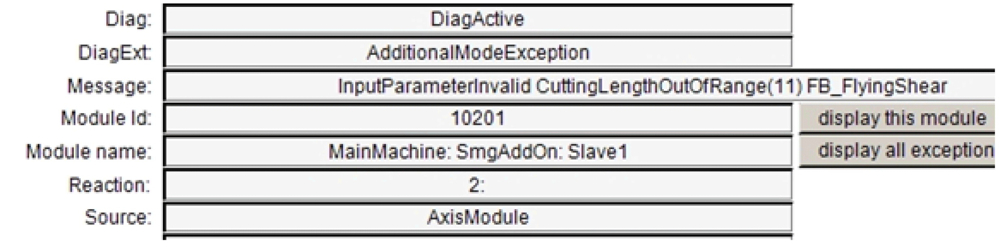

# Error Handling in the Application

Error Handling in the Application

Errors that the application discovers are also sent to the FB\_SmgAddOnModule via the variable stApplicationItf and from there to the axis module. In the method CheckParameter of the FB\_FlyingShear, this mechanism is used.

The following figure shows the message that is generated through an invalid entry of the segment length:

