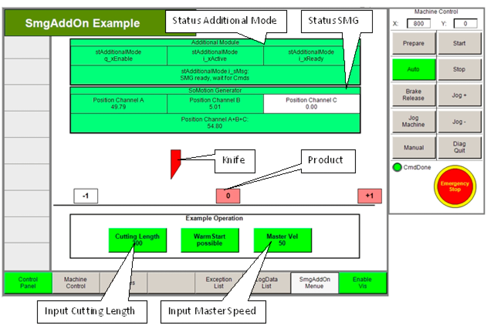

# Visualization

Visualization

In addition, a simple visualization is available for the application:

The parameters CuttingLength and MasterSpeed can be changed via the visualization. The variables of the visualization are updated in the action logic of the equipment module.