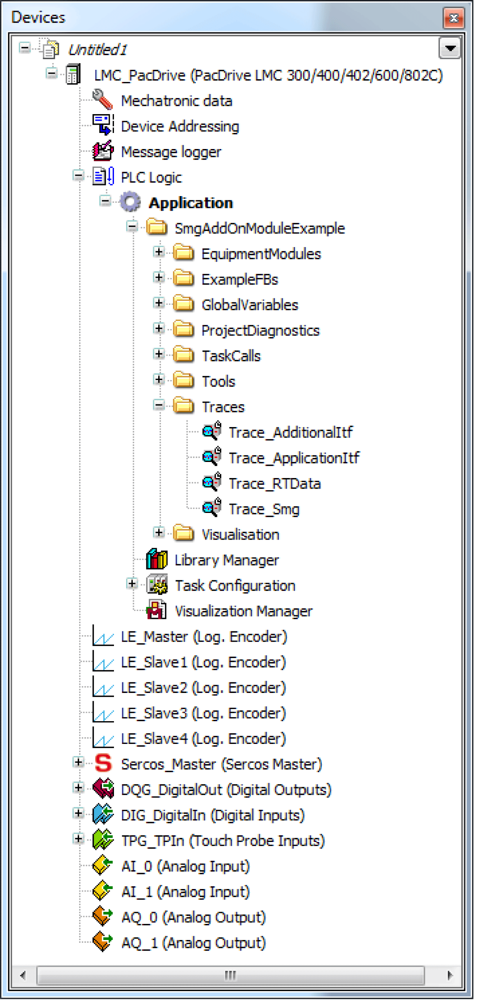
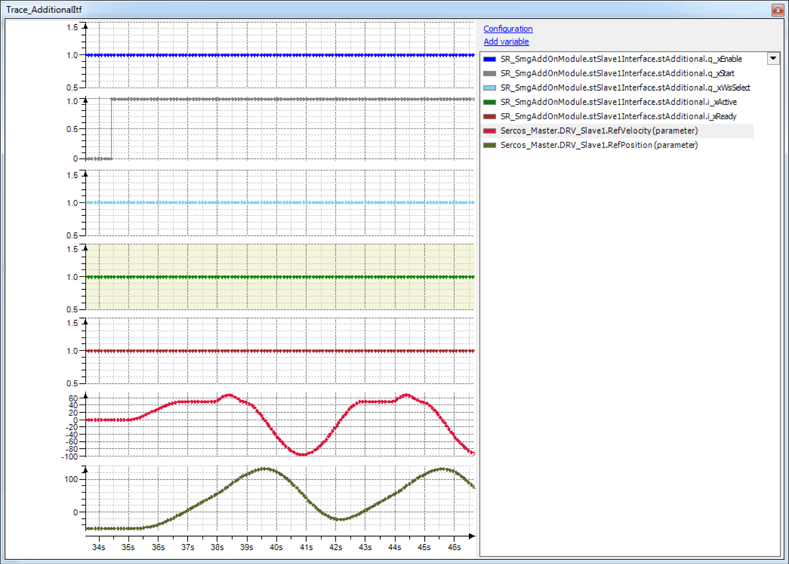
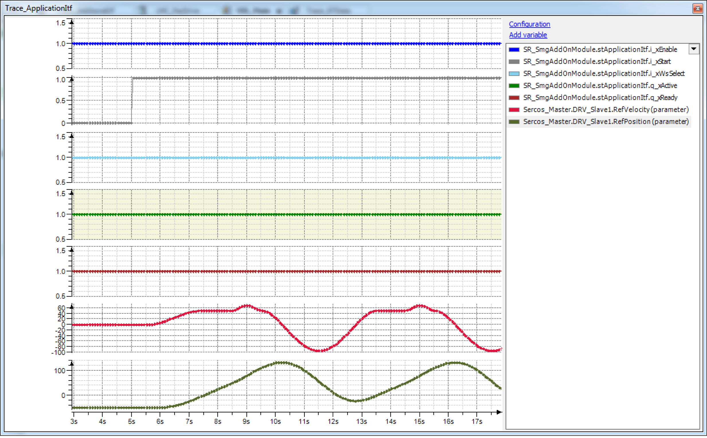
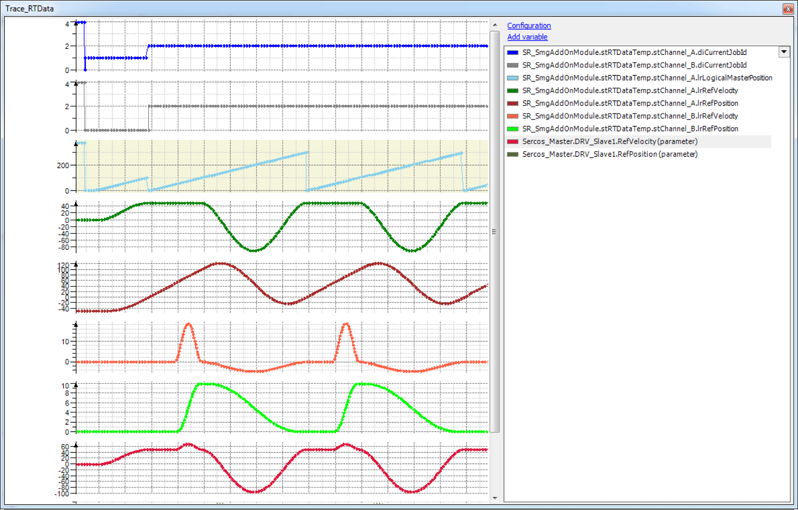

# Description

Description

The traces which are located in the folder SmgAddOnModuleExample\Traces of the demo project are made to explain how the SoMotionGenerator module is working.

SmgAddOnModuleExample Folder

Trace\_AdditionalItf: This trace shows the substantial variables which are sent by the module interface to the application.

Trace\_AdditionalItf

Trace\_ApplicationItf: This trace shows the substantial variables which are received by the application from the module interface.

Trace\_ApplicationItf

Trace\_RTData: This trace shows the superposition of cam curves which are generated by the FB\_SoMotionGenerator.

Trace\_RTData

