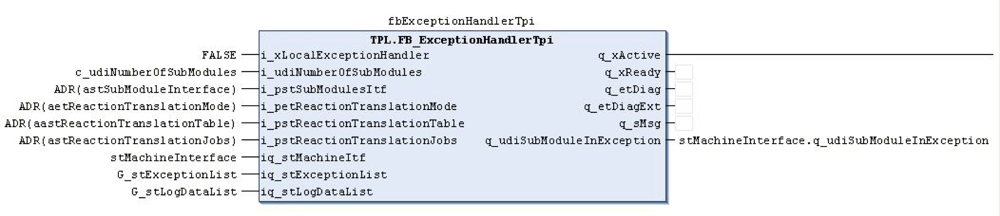

# FB\_ExceptionHandlerTpi - General Information

## Overview

|  |  |
| --- | --- |
| Type: | Function Block |
| Available as of: | V1.1.0.0 |
| Support for: | PacDrive pilot template architecture |

## Task

Function block for monitoring and managing the global exception list.

## Description

The primary purpose of this POU is to distribute reactions. A reaction describes how an axis should stop when an exception occurs and there are five basic reactions as follows:

* TPL.ET\_Reaction.AsyncStop
* TPL.ET\_Reaction.SyncStopEl
* TPL.ET\_Reaction.AsyncStopEh
* TPL.ET\_Reaction.StopEndOfCycle
* TPL.ET\_Reaction.MainsConstactorOff (\*Not used by the *[AXM.FB\_AxisModuleTpi](../../../../../api/crossBook?lang=en-US&virtualBookName=PD.Lib.AxisModule&topicID=D_SE_0077145)* POU)

Every exception generated by the system, by most functions and POUs, and by the user program has a reaction associated with it. The *[AXM.FB\_AxisModuleTpi](../../../../../api/crossBook?lang=en-US&virtualBookName=PD.Lib.AxisModule&topicID=D_SE_0077145)* POU, for instance, monitors itself and its associated axes for errors detected. User code typically uses the FC\_SetExceptionTpi function to define and control exceptions. The exception with its associated reaction is also entered into the global exception list when the exception becomes active.

The global exception list is specified with the iq\_stExceptionList input and contains the active errors detected. The global logging list is specifies with the iq\_stLogDataList input and it holds the last 100 errors (default). This default can be modified by changing the value of TPL.Gc\_udiMaxNumberOfExecptions. A newly error will replace the oldest one once the logging list becomes full. The logging list can also contain other events.

This function block searches for reactions as long as the machine is activated (iq\_stMachineInterface.i\_xEnable). The function block indicates that it is active and processing with the q\_xActive output.

The input i\_xLocalExceptionHandler specifies where reactions are searched for. The input i\_ xLocalExceptionHandler has always to be FALSE because the TemplatePilot supports no submodules needing an own ExceptionHandler.

This function block searches as a global exception handler (i\_xLocalExceptionHandler := FALSE;) the global exception list for changes. It distributes the reaction associated with any existing exceptions contained in the global exception list to all the associated sub-modules (axes). Using the i\_pstSubModulesItf input, the POU receives all information concerning all existing axes. This input needs the address of an array of the ST\_StandardModuleInterface type. Using the i\_udiNumberOfSubModules input, the POU receives the number of available sub-modules.

The distribution of the reactions can be influenced by different modes. The translation modes are processed via the i\_psReactionTranslationJobs input. This structure is set to default values with the FC\_InitReactionTranslationMode function. The default setting of this structure directs the distribution of reactions based on a reaction table specified by the i\_pstReactionTranslationTable input.

The reaction table is set to default values with the TPL.FC\_InitReactionTranslationTable function. In default setting, each sub-module (axis) receives the same reaction that is found. If, for instance, an exception with reaction 2 is found in the global exception list, each axis contains reaction 2 (TPL.ET\_Reaction.SyncStopEl).

The exception translation structure and/or the reaction table can be re-configured to change how error detection reactions are distributed. With it, for instance, it is also possible to extract individual modules (axes) from an emergency-stop circuit and to support several emergency-stop circuits in one machine.

The function block also manages the global exception list if it is selected (i\_xLocalExceptionHandler := FALSE). It manages the following functions:

* Updates the elapse time of each exception in the global exception list
* Distributes the DiagQuit signal (iq\_stMachineInterface.i\_xDiagQuit) to the sub-modules (axes).
* Resets the system errors by DiagQuit (iq\_stMachineInterface.i\_xDiagQuit).
* Removes inactive exceptions from the global exception list.

The q\_etDiag output reports <> GD.ET\_Diag.Ok when any reaction is found or the following inputs are not set correctly:

* The input i\_pstSubModulesItf is less than or equal zero.
* The input i\_pstReactionTranslationTable is less than or equal zero.
* The size of the input i\_udiNumberOfSubModules does not correspond to the diSizeOfSubModuleInterface input.

These exceptions have a TPL.ET\_Reaction.AsyncStop reaction.

The q\_udiSubModuleInException output indicates which sub-module has an exception. The sub-module with the lowest index number is shown if multiple sub-modules have an exception.

This is a function block that will require an instance of it to be declared.

**Call-up in FBD**

## Interface

| Input | Data type | Description |
| --- | --- | --- |
| i\_xLocalExceptionHandler | BOOL | Specifies if the POU is a local or global exception handler |
| i\_udiNumberOfSubModules | UDINT | Specifies the quantity of sub-modules in the default module interface array. |
| i\_pstSubModulesItf | POINTER TO [ST\_StandardModuleInterface](D-SE-0078570.html#D-SE-0078570) | Specifies a pointer to the default module interface |
| i\_petReactionTranslationMode | POINTER TO ET\_ReactionTranslationMode | Specifies a pointer to the reaction translation mode. |
| i\_pstReactionTranslationTable | POINTER TO ST\_Reaction | Specifies a pointer to the reaction table. |
| i\_pstReactionTranslationJobs | POINTER TO ST\_ReactionTranslationJobs | Specifies a pointer to the reaction translation jobs. |

| Output | Data type | Description |
| --- | --- | --- |
| q\_xActive | BOOL | Indicates that the POU is active and must be called up. |
| q\_xReady | BOOL | Indicates that the POU is ready now. |
| q\_etDiag | [GD.ET\_Diag](../../../../../api/crossBook?lang=en-US&virtualBookName=PD.Lib.GlobalDiagnostic&topicID=D_SE_0076228) | Indicates whether an internal exception has occurred (q\_etDiag <> Gd.Et\_Diag.Ok). |
| q\_etDiagExt | [ET\_DiagExt](D-SE-0078342.html#D-SE-0078342) | Further specifies the reason for the exception. |
| q\_sMsg | STRING[80] | Plain text message of the reason for the exception. |
| q\_udiSubModuleInException | UDINT | Indicates which sub-module is in error detection. The sub-module with the lower index number is shown if multiple sub-modules have errors that have been detected. |

| Input/Output | Data type | Description |
| --- | --- | --- |
| iq\_stMachineItf | ST\_StandardModuleInterface | Specifies the default module interface for the machine |
| iq\_stExceptionList | ST\_ExceptionList | Specifies the global error detection list |
| iq\_stLogDataList | ST\_LogDataList | Specifies the global logging list |

## Diagnostic Messages

| q\_etDiag | q\_etDiagExt | Enumeration value | Description |
| --- | --- | --- | --- |
| OK | Disabled | 22 | Diagnostic message disabled |
| OK | Initializing | 37 | Initialization |
| OK | Working | 47 | The POU processes the function |
| ControllerConditionInvalid | ControllerInvalid | 6 | The controller is invalid. |
| InputParameterInvalid | PointerReactionTranslationJobsInvalid | 144 | The pointer ReactionTranslationJobs is invalid |
| InputParameterInvalid | PointerReactionTranslationModeInvalid | 146 | The pointer ReactionTranslationMode is invalid |
| InputParameterInvalid | PointerReactionTranslationTableInvalid | 139 | The pointer ReactionTranslationTable is invalid |
| InputParameterInvalid | PointerSubModulesItfInvalid | 97 | The pointer SubModulesItf is invalid |
| InputParameterInvalid | ReactionTranslationEntryInvalid | 141 | An entry of a reaction transfer is invalid |
| InputParameterInvalid | SizeOfSubModulesItfInvalid | 96 | The size of the submodule interface is invalid |
| UnexpectedProgramBehavior | InitExceptionListFailed | 46 | Initialization of the exception list failed. |

## ControllerInvalid

|  |  |
| --- | --- |
| Enumeration name: | ControllerInvalid |
| Enumeration value: | 6 |
| Description: | The controller is invalid. |

| Issue | Cause | Solution |
| --- | --- | --- |
| - | The controller does not provide the required conditions. | For more details, see q\_sMsg output. |

## Disabled

|  |  |
| --- | --- |
| Enumeration name: | Disabled |
| Enumeration value: | 22 |
| Description: | Diagnostic message disabled |

The function block is deactivated, it executes no actions whatsoever. i\_xEnable and q\_xActive have the value FALSE.

## InitExceptionListFailed

|  |  |
| --- | --- |
| Enumeration name: | InitExceptionListFailed |
| Enumeration value: | 46 |
| Description: | Initialization of the exception list failed. |

| Issue | Cause | Solution |
| --- | --- | --- |
| - | Initialization of the exception list failed. An error has been detected and occurred in the internal execution. | Try to initialize the exception list using the FC\_InitExceptionList function.  Please inform the support team about this detected error. |

## Initializing

|  |  |
| --- | --- |
| Enumeration name: | Initializing |
| Enumeration value: | 37 |
| Description: | Initialization |

The function block is being initialized and thus is not yet ready to receive commands at its inputs. The function block will signalize that it is ready for operation with the signal q\_xReady = TRUE.

## PointerReactionTranslationJobsInvalid

|  |  |
| --- | --- |
| Enumeration name: | PointerReactionTranslationJobsInvalid |
| Enumeration value: | 144 |
| Description: | The pointer ReactionTranslationJobs is invalid |

| Issue | Cause | Solution |
| --- | --- | --- |
| - | An invalid value was applied at the i\_pstReactionTranslationJobs input. | A valid memory address unequal 0 has to be transferred to the i\_pstReactionTranslationJobs input. |

## PointerReactionTranslationModeInvalid

|  |  |
| --- | --- |
| Enumeration name: | PointerReactionTranslationModeInvalid |
| Enumeration value: | 146 |
| Description: | The pointer ReactionTranslationMode is invalid |

| Issue | Cause | Solution |
| --- | --- | --- |
| - | An invalid value was applied at the i\_petReactionTranslationMode input. | A valid memory address unequal 0 has to be transferred to the i\_petReactionTranslationMode input. |

## PointerReactionTranslationTableInvalid

|  |  |
| --- | --- |
| Enumeration name: | PointerReactionTranslationTableInvalid |
| Enumeration value: | 139 |
| Description: | The pointer ReactionTranslationTable is invalid |

| Issue | Cause | Solution |
| --- | --- | --- |
| - | At the input i\_pstReactionTranslationTable an invalid value has been applied. | A valid memory address unequal 0 has to be transferred to the i\_pstReactionTranslationTable input. |

## PointerSubModulesItfInvalid

|  |  |
| --- | --- |
| Enumeration name: | PointerSubModulesItfInvalid |
| Enumeration value: | 97 |
| Description: | The pointer SubModulesItf is invalid |

| Issue | Cause | Solution |
| --- | --- | --- |
| - | The input i\_pstSubModulesItf is set to zero | The input i\_pstSubModulesItf has to be connected with the address of the array of Submodule interface structures. |

## ReactionTranslationEntryInvalid

|  |  |
| --- | --- |
| Enumeration name: | ReactionTranslationEntryInvalid |
| Enumeration value: | 141 |
| Description: | An entry of a reaction transfer is invalid |

| Issue | Cause | Solution |
| --- | --- | --- |
| - | A reaction translation job of the ET\_ReactionTranslationMode.Jobs translation mode is invalid. | The following must apply for a translation job:   * udiSourceStart >= 1 * udiNumReactions >= 1 * udiSourceStart + udiNumReactions - 1 <= Gc\_udiMaxNumberOfReactions * udiTargetStart + udiNumReactions - 1 <= Gc\_udiMaxNumberOfReactions |

## SizeOfSubModulesItfInvalid

|  |  |
| --- | --- |
| Enumeration name: | SizeOfSubModulesItfInvalid |
| Enumeration value: | 96 |
| Description: | The size of the submodule interface is invalid |

| Issue | Cause | Solution |
| --- | --- | --- |
| - | The value of the i\_udiSizeOfSubModulesItf input is invalid. | The specification at the i\_diNumberOfSubModules input does not correspond to the specification at the i\_udiSizeOfSubModulesItf input. |

## Working

|  |  |
| --- | --- |
| Enumeration name: | Working |
| Enumeration value: | 47 |
| Description: | The POU processes the function |

The function block distributes reactions to subordinate modules.

EIO0000002668.01

© 2022

Schneider Electric.

All rights reserved.