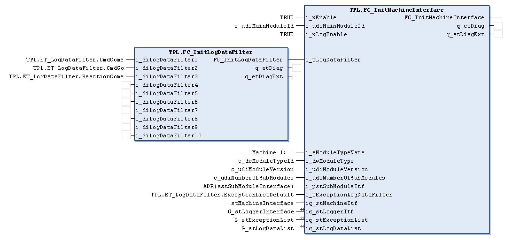

# FB\_LoggerTpi - General Information

## Overview

|  |  |
| --- | --- |
| Type: | Function Block |
| Available as of: | - |
| Support for: | PacDrive pilot template architecture |

## Task

Function block for logging events into the global logging list.

## Description

This POU records the following interactions between a module (machine) and its sub-module (axis):

* Which reactions were sent to the axes
* Which commands were sent to the axes
* Which start steps were sent to the axes

The events are saved in the global logging list specified with the iq\_stLogDataList input. The list stores the last 100 events (default). This default can be modified by changing the value of TPL.Gc\_udiMaxNumberOfLogData. The newest event overwrites the oldest event once the list is full. It is useful for debugging and/or displaying historical data on a HMI.

The reactions, commands, and start steps are monitored through the default module interface for the machine specified with the iq\_stMachineItf input. The POU logs events when it detects changes in the signals. The specific event to log is controlled by setting up “filters”.

The ET\_LogDataFilter enumeration type can be used to specify which events are to be logged as follows:

ET\_LogDataFilter.None := 2#0000000000000000

Log nothing or indicates a blank entry in the list

ET\_LogDataFilte.CmdDone := 2#0000000000000001

Log when a command appears (diCMD > 0)

ET\_LogDataFilter.CmdGo := 2#0000000000000010

Log when a command appears (diCMD > 0)

ET\_LogDataFilter.StartStepCome := 2#0000000000000100

Log when a start step appears (diStartStep > 0)

ET\_LogDataFilter.StartStepGo := 2#0000000000001000

Log when a start step finishes (diStartStep = 0)

ET\_LogDataFilter.ReactionCome := 2#0000000000010000

Log when a reaction occurs (stReaction.axReaction[X] = TRUE)

ET\_LogDataFilter.ReactionGo := 2#0000000000100000

Log when a reaction ends (stReaction.axReaction[X] = FALSE)

ET\_LogDataFilter.ExceptionQuit := 2#0000000001000000

Log when an exception or advisory becomes inactive

ET\_LogDataFilter.ExceptionCome := 2#0000000010000000

Log when an exception or advisory becomes active

ET\_LogDataFilter.ExceptionAutoQuit := 2#0000000100000000

Log when an exception or advisory automatically becomes inactive

ET\_LogDataFilter.User := 2#0000001000000000

ET\_LogDataFilter.ModuleDefault := 2#0000000000111111

ET\_LogDataFilter.ExceptionListDefault := 2#0000000111000000

The filter is of type DWORD with each bit position defining a specific type of event. The filters above can be summarized to one filter using an OR operation or by using the FC\_InitLogDataFilter POU which causes the logger to react on the corresponding events. The FC\_InitMachineInterface function also activates/deactivates the logging of events as shown below:

The output q\_xActive indicates that the logger is activated and working correctly. The internal status of the function block can be read at the output q\_etDiag and the corresponding message at the q\_etDiagExt output. All the exceptions that are triggered by the function block are recorded in the defined global exception list by the in-/output iq\_stExceptionList.

This is a function block that will require an instance of it to be declared.

## Interface

| Output | Data type | Description |
| --- | --- | --- |
| q\_xActive | BOOL | The POU is switched on and still has to be called up |
| q\_xReady | BOOL | The POU is ready and processing normally |
| q\_etDiag | [GD.ET\_Diag](../../../../../api/crossBook?lang=en-US&virtualBookName=PD.Lib.GlobalDiagnostic&topicID=D_SE_0076228) | Diagnostic class |
| q\_etDiagExt | [ET\_DiagExt](D-SE-0078342.html#D-SE-0078342) | Detailed diagnostic code of the POU |

| Input/Output | Data type | Description |
| --- | --- | --- |
| iq\_stMachineItf | ST\_StandardModuleInterface | Specifies the default module interface for the machine |
| iq\_stExceptionList | ST\_ExceptionList | Specifies the global error detection list |
| iq\_stLogDataList | ST\_LogDataList | Specifies the global logging list |

## Diagnostic Messages

| q\_etDiag | q\_etDiagExt | Enumeration value | Description |
| --- | --- | --- | --- |
| OK | Disabled | 22 | Diagnostic message disabled |
| OK | Initializing | 37 | Initialization |
| OK | WaitForEvent | 23 | Waiting for an event. |
| UnexpectedProgramBehavior | InitLogDataListFailed | 48 | Initialization of the log data list failed. |

## Disabled

|  |  |
| --- | --- |
| Enumeration name: | Disabled |
| Enumeration value: | 22 |
| Description: | Diagnostic message disabled |

The function block is deactivated, it executes no actions whatsoever. i\_xEnable and q\_xActive have the value FALSE.

## Initializing

|  |  |
| --- | --- |
| Enumeration name: | Initializing |
| Enumeration value: | 37 |
| Description: | Initialization |

The function block is being initialized and thus is not yet ready to receive commands at its inputs. The function block will signalize that it is ready for operation with the signal q\_xReady = TRUE.

## InitLogDataListFailed

|  |  |
| --- | --- |
| Enumeration name: | InitLogDataListFailed |
| Enumeration value: | 48 |
| Description: | Initialization of the log data list failed. |

| Issue | Cause | Solution |
| --- | --- | --- |
| - | Initialization of the exception list failed. An error has been detected and occurred in the internal execution. | Try to initialize the exception list using the FC\_InitLogDataList function.  Please inform the support team about this detected error. |

## WaitForEvent

|  |  |
| --- | --- |
| Enumeration name: | WaitForEvent |
| Enumeration value: | 23 |
| Description: | Waiting for an event. |

Waiting for an event to be entered into the log data list.

EIO0000002668.01

© 2022

Schneider Electric.

All rights reserved.