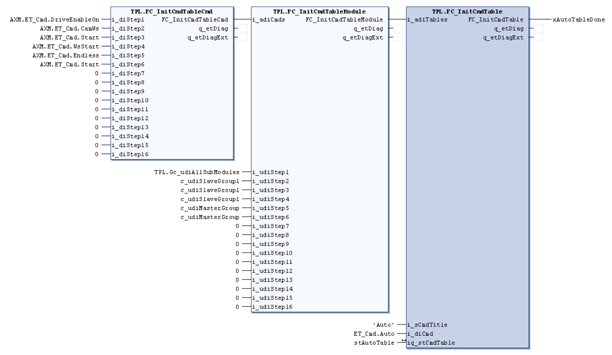

# FC\_InitCmdTable - General Information

## Overview

|  |  |
| --- | --- |
| Type: | Function |
| Available as of: | V1.1.0.0 |
| Support for: | PacDrive pilot template architecture |

## Task

Function for initialization of an axis that is controlled by the function block *[AXM.FB\_AxisModuleTpi](../../../../../api/crossBook?lang=en-US&virtualBookName=PD.Lib.AxisModule&topicID=D_SE_0077145)*.

## Description

This function is used to assign a number and text name to a command table and to place the table into the command table list. Commands tell an axis or a group of axes what to do such as “start homing”. A command table is an ordered list of commands that the FB\_ModuleControllerTpi function block uses to command an axis or a group of axes. A command table list holds the command tables. It is easier to pass a list of command tables to the FB\_ModuleControllerTpi function block than passing individual tables.

Via the i\_adiTables input an array is transferred that holds the ordered list of commands and the axes associated with the commands. The array was previously set up using the functions FC\_InitCmdTableCmd and FC\_InitCmdTableModule as shown below.

A text name is assigned to the table with the i\_sCmdTitle input and a table number is assigned with the i\_diCmd input. The AXM.FB\_AxisModuleController POU executes a command table by using a table number. Within the enumeration type ET\_Cmd specific command names are assigned to a table number as follows:

* ET\_Cmd.NoCmd := 0,
* ET\_Cmd.DriveEnableOn := 25999,
* ET\_Cmd.DriveEnableOff := 25998,
* ET\_Cmd.Init := 25997,
* ET\_Cmd.Prepare := 25996,
* ET\_Cmd.Production := 25995,
* ET\_Cmd.Auto := 25994,
* ET\_Cmd.BrakeRelease := 25993,
* ET\_Cmd.Abort := 25992,
* ET\_Cmd.StandBy := 25991,
* ET\_Cmd.Manual := 25990,
* ET\_Cmd.Jogging := 25989,
* ET\_Cmd.Hold := 25988,
* ET\_Cmd.Stop := 25987,
* ET\_Cmd.Start := 25986,
* ET\_Cmd.HoldJm := 25985

The ET\_Cmd is declared an enumeration type in the data type area to allow users to add their own command tables. The value of a command table number has to be greater than 25,000.

The watch dog time of each command step (timTimeOut) is set to zero by this function block.

The value of the function is TRUE after the command table is added to the command table list.

## Interface

| Input | Data type | Description |
| --- | --- | --- |
| i\_adiTables | ARRAY[1..34] OF DINT | Specifies which list of ordered commands with associated axes to use |
| i\_sCmdTitle | STRING(80) | Specifies a text name for the command table |
| i\_diCmd | DINT | Specifies a number for the command table |

| Output | Data type | Description |
| --- | --- | --- |
| q\_etDiag | [GD.ET\_Diag](../../../../../api/crossBook?lang=en-US&virtualBookName=PD.Lib.GlobalDiagnostic&topicID=D_SE_0076228) | General, library-independent statement on the diagnostic.  A value unequal to GD.ET\_Diag.Ok corresponds to a diagnostic message. |
| q\_etDiagExt | [ET\_DiagExt](D-SE-0078342.html#D-SE-0078342) | POU-specific output on the diagnostic.  q\_etDiag = GD.ET\_Diag.Ok -> status message  q\_etDiag <> GD.ET\_Diag.Ok -> diagnostic message |

| Input/Output | Data type | Description |
| --- | --- | --- |
| iq\_stCmdTable | ST\_CmdTableTpi | Specifies the structure used to hold all the command tables |

## Return Value

| Data type | Description |
| --- | --- |
| BOOL |  |

## Diagnostic Messages

| q\_etDiag | q\_etDiagExt | Enumeration value | Description |
| --- | --- | --- | --- |
| OK | Ok | 0 | Ok |
| InputParameterInvalid | UnexpectedDiagExt | 147 | An unexpected detected error occurred during the execution. |

## Ok

|  |  |
| --- | --- |
| Enumeration name: | Ok |
| Enumeration value: | 0 |
| Description: | Ok |

## UnexpectedDiagExt

|  |  |
| --- | --- |
| Enumeration name: | UnexpectedDiagExt |
| Enumeration value: | 147 |
| Description: | An unexpected detected error occurred during the execution. |

| Issue | Cause | Solution |
| --- | --- | --- |
| - | Input parameter invalid. A value in the array i\_adiTables is invalid. | Change the values in the array i\_adiTables so that the following applies:  If a value in i\_adiTables[1..17] is <> 0, then the associated position in the array i\_adiTables[X+17] has to be <> 0 also. |

EIO0000002668.01

© 2022

Schneider Electric.

All rights reserved.