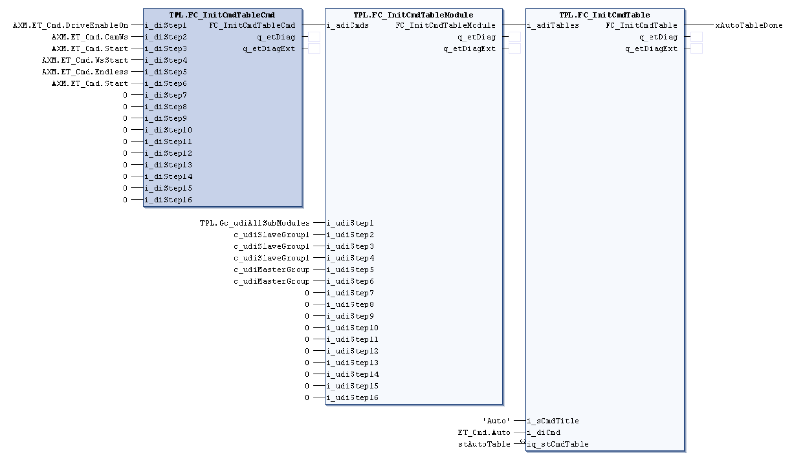

# FC\_InitCmdTableCmd - General Information

## Overview

|  |  |
| --- | --- |
| Type: | Function |
| Available as of: | V1.1.0.0 |
| Support for: | PacDrive pilot template architecture |

## Task

Function for initialization of an axis that is controlled by the function block *[AXM.FB\_AxisModuleTpi](../../../../../api/crossBook?lang=en-US&virtualBookName=PD.Lib.AxisModule&topicID=D_SE_0077145)*.

## Description

This function assigns command to a command table. An axis or a group of axes holds commands such as "start homing". A command table is an ordered list of commands that the AXM.FC\_AxisModuleController function block uses to command an axis or a group of axes.

The function has to be activated with i\_xEnable input in order to assign the commands on the inputs i\_diStep1 to i\_diStep16. The command on i\_diStep1 is executed first. The command on i\_diStep2 is executed after the first command has finished. This proceeds until the command on i\_diStep16 has been carried out.

All possible commands are enumerated in type AXM.ET\_Cmd as follows:

* AXM.ET\_Cmd.Homing := 10
* AXM.ET\_Cmd.Manual := 20
* AXM.ET\_Cmd.CamCs := 30
* AXM.ET\_Cmd.CamWs := 31
* AXM.ET\_Cmd.Endless := 40
* AXM.ET\_Cmd.EndlessIls := 41
* AXM.ET\_Cmd.Positioning := 50
* AXM.ET\_Cmd.BrakeRelease := 70
* AXM.ET\_Cmd.AdditionalCs := 80
* AXM.ET\_Cmd.AdditionalWs := 81
* AXM.ET\_Cmd.Start := 100
* AXM.ET\_Cmd.StartTrig := 101
* AXM.ET\_Cmd.StratTrigWaitInPos := 102
* AXM.ET\_Cmd.Stop := 110
* AXM.ET\_Cmd.Hold := 120
* AXM.ET\_Cmd.DriveEnableOn := 130
* AXM.ET\_Cmd.DriveEnableOff := 140
* AXM.ET\_Cmd.WsStart := 150

The value of the function is an array that holds the assigned commands. The array is passed to the FC\_InitCmdTableModule function which associates an axis or a group of axes to each command as displayed below:

The axis or group of axes that are assigned to the i\_udiStep1 is given the command on i\_diStep1 input and so forth.

## Interface

| Input | Data type | Description |
| --- | --- | --- |
| i\_xEnable | BOOL | Enables the assignment of commands to a Command Table |
| i\_diStep1 | DINT | Specifies a command. Up to 16 commands can be specified |

| Output | Data type | Description |
| --- | --- | --- |
| q\_etDiag | [GD.ET\_Diag](../../../../../api/crossBook?lang=en-US&virtualBookName=PD.Lib.GlobalDiagnostic&topicID=D_SE_0076228) | General, library-independent statement on the diagnostic.  A value unequal to GD.ET\_Diag.Ok corresponds to a diagnostic message. |
| q\_etDiagExt | [ET\_DiagExt](D-SE-0078342.html#D-SE-0078342) | POU-specific output on the diagnostic.  q\_etDiag = GD.ET\_Diag.Ok -> status message  q\_etDiag <> GD.ET\_Diag.Ok -> diagnostic message |

## Return Value

| Data type | Description |
| --- | --- |
| ARRAY[1..17] OF DINT | The value of the function is an array that holds the assigned commands. |

## Diagnostic Messages

| q\_etDiag | q\_etDiagExt | Enumeration value | Description |
| --- | --- | --- | --- |
| OK | Ok | 0 | Ok |

## Ok

|  |  |
| --- | --- |
| Enumeration name: | Ok |
| Enumeration value: | 0 |
| Description: | Ok |

EIO0000002668.01

© 2022

Schneider Electric.

All rights reserved.