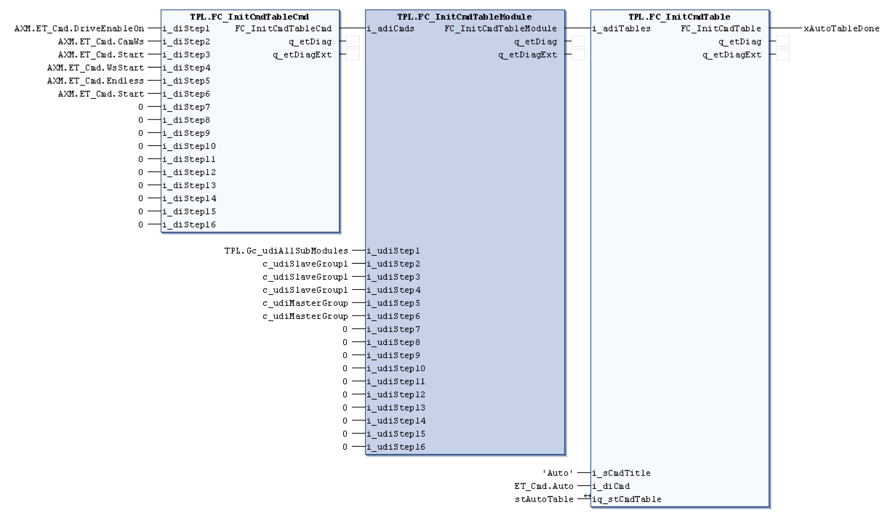

# FC\_InitCmdTableModule - General Information

## Overview

|  |  |
| --- | --- |
| Type: | Function |
| Available as of: | V1.1.0.0 |
| Support for: | PacDrive pilot template architecture |

## Task

Function for initialization of an axis that is controlled by the function block *[AXM.FB\_AxisModuleTpi](../../../../../api/crossBook?lang=en-US&virtualBookName=PD.Lib.AxisModule&topicID=D_SE_0077145)*.

## Description

This function is used to assign an axis or a group of axes to each command previously specified with the FC\_InitCmdTableCmd function. Commands tell an axis or a group of axes what to do such as “start homing”. A command table is an ordered list of commands that the FB\_ModuleControllerTpi function block uses to command an axis or a group of axes.

Group of axes are defined by the FC\_InitCmdGroup function.

The return value of the FC\_InitCmdTableModule function is an array that holds the commands assigned to an axis or a group. The return value is passed to the FC\_InitCmdTable function that assigns the table a name and a number. The use of the described function is provided as follows:

The axis or group of axes that are assigned to the i\_udiStep1 is given the command on i\_diStep1 input and so forth.

## Interface

| Input | Data type | Description |
| --- | --- | --- |
| i\_adiCmds | ARRAY[1..17] OF DINT | Specifies which list of ordered commands with associated axes to use |
| i\_udiStep1 | UDINT | Specifies an axis or a group of axes, up to 16 axis and/or groups can be specified |

| Output | Data type | Description |
| --- | --- | --- |
| q\_etDiag | [GD.ET\_Diag](../../../../../api/crossBook?lang=en-US&virtualBookName=PD.Lib.GlobalDiagnostic&topicID=D_SE_0076228) | General, library-independent statement on the diagnostic.  A value unequal to GD.ET\_Diag.Ok corresponds to a diagnostic message. |
| q\_etDiagExt | [ET\_DiagExt](D-SE-0078342.html#D-SE-0078342) | POU-specific output on the diagnostic.  q\_etDiag = GD.ET\_Diag.Ok -> status message  q\_etDiag <> GD.ET\_Diag.Ok -> diagnostic message |

## Return Value

| Data type | Description |
| --- | --- |
| ARRAY[1..34] OF DINT |  |

## Diagnostic Messages

| q\_etDiag | q\_etDiagExt | Enumeration value | Description |
| --- | --- | --- | --- |
| OK | Ok | 0 | Ok |

## Ok

|  |  |
| --- | --- |
| Enumeration name: | Ok |
| Enumeration value: | 0 |
| Description: | Ok |

EIO0000002668.01

© 2022

Schneider Electric.

All rights reserved.