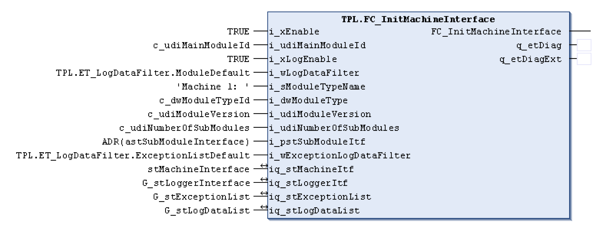

# FC\_InitMachineInterface - General Information

## Overview

|  |  |
| --- | --- |
| Type: | Function |
| Available as of: | - |
| Support for: | PacDrive pilot template architecture |

## Task

Initializes the parts of the interface of the MainMachine.

## Description

This function is used to setup a software module to act as a machine layer. The typical use is to setup a module to act as the “machine” to provide overall control of the machine.

The user may only change the values on the inputs i\_xEnable, i\_xLogEnable, i\_wLogDataFilter and i\_wExceptionLogDataFilter.

The machine is activated via the i\_xEnable input, which activates important POUs of the machine layer such as axis modules, axis module controllers, and module controllers.

This function automatically assigns a unique module ID to the axes contained in the machine module.

How to create the module ID of an axis can be read in the chapter "Identification and labeling of modules".

The wiring of the inputs can be seen in the following figure. Also for the above mentioned inputs that can be changed, it is strongly recommended to use the suggested default values.

## Interface

| Input | Data type | Description |
| --- | --- | --- |
| i\_xEnable | BOOL | Activates the module. |
| i\_udiMainModuleId | UDINT | Unique number used to identify the module  The module ID identifier can be used to filter the global detected error list and/or the global logger list. The main machine must be given the Id 1. |
| i\_xLogEnable | BOOL | Enables the logging function. |
| i\_wLogDataFilter | WORD | Specifies the events to be recorded. |
| i\_sModuleTypeName | STRING[80] | Specifies a name the module is identified with. |
| i\_dwModuleType | DWORD | Unique number to identify the type of module |
| i\_udiModuleVersion | UDINT | Specifies the software version of the module type |
| i\_udiNumberOfSubModules | UDINT | Specifies the quantity of sub-modules contained by this module |
| i\_pstSubModuleItf | POINTER TO [ST\_StandardModuleInterface](D-SE-0078570.html#D-SE-0078570) | A pointer to the default module interface of the submodules. |
| i\_wExceptionLogDataFilter | WORD | Log filter for the exception handling (actions on the exception list) |

| Output | Data type | Description |
| --- | --- | --- |
| q\_etDiag | [GD.ET\_Diag](../../../../../api/crossBook?lang=en-US&virtualBookName=PD.Lib.GlobalDiagnostic&topicID=D_SE_0076228) | General, library-independent statement on the diagnostic.  A value unequal to GD.ET\_Diag.Ok corresponds to a diagnostic message. |
| q\_etDiagExt | [ET\_DiagExt](D-SE-0078342.html#D-SE-0078342) | POU-specific output on the diagnostic.  q\_etDiag = GD.ET\_Diag.Ok -> status message  q\_etDiag <> GD.ET\_Diag.Ok -> diagnostic message |

| Input/Output | Data type | Description |
| --- | --- | --- |
| iq\_stMachineItf | [ST\_StandardModuleInterface](D-SE-0078570.html#D-SE-0078570) | Specifies the default module interface |
| iq\_stExceptionList | [ST\_ExceptionList](D-SE-0078550.html#D-SE-0078550) | Global exception list |
| iq\_stLogDataList | [ST\_LogDataList](D-SE-0078556.html#D-SE-0078556) | Specifies the global logging list. |
| iq\_stLoggerItf | [ST\_LoggerInterface](D-SE-0078560.html#D-SE-0078560) | Data structure to control displaying and saving the logger. |

## Return Value

| Data type | Description |
| --- | --- |
| BOOL |  |

## Diagnostic Messages

| q\_etDiag | q\_etDiagExt | Enumeration value | Description |
| --- | --- | --- | --- |
| OK | Ok | 0 | Ok |

## Ok

|  |  |
| --- | --- |
| Enumeration name: | Ok |
| Enumeration value: | 0 |
| Description: | Ok |

EIO0000002668.01

© 2022

Schneider Electric.

All rights reserved.