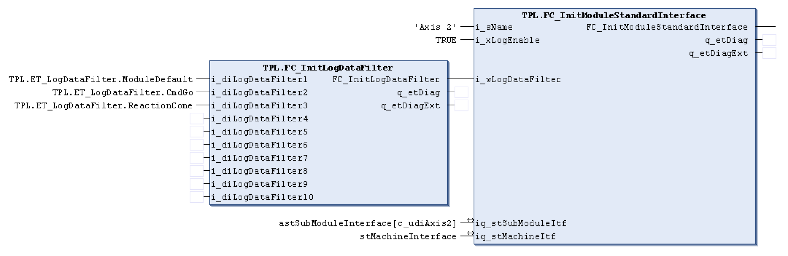

# FC\_InitModuleStandardInterface - General Information

## Overview

|  |  |
| --- | --- |
| Type: | Function |
| Available as of: | V1.1.0.0 |
| Support for: | PacDrive pilot template architecture |

## Task

Function for initialization of an axis that is controlled by function block *[AXM.FB\_AxisModuleTpi](../../../../../api/crossBook?lang=en-US&virtualBookName=PD.Lib.AxisModule&topicID=D_SE_0077145)*.

## Description

The axis specified with iq\_stSubModuleItf is given a text name via this function. The name is combined with the associated layer’s name to identify detected errors, log entries, and result text of other function blocks.

The axis’s logger can also be enabled with the i\_xLogEnable input. What is to be logged is specified with the i\_wLogDataFilter input. This input is definied and every bit position stands for a specific event to record. The ET\_LogDataFilter enumeration type can be used to specify which events are to be logged as follows:

A complete filter can be setup by combining the individual filters with an “OR” statement or by using the FC\_InitLogDataFilter function as follows:

## Interface

| Input | Data type | Description |
| --- | --- | --- |
| i\_sName | STRING[80] | Text name of the axis |
| i\_xLogEnable | BOOL | Activating the logger function. |
| i\_wLogDataFilter | WORD | Specifies the events to be recorded. |

| Output | Data type | Description |
| --- | --- | --- |
| q\_etDiag | [GD.ET\_Diag](../../../../../api/crossBook?lang=en-US&virtualBookName=PD.Lib.GlobalDiagnostic&topicID=D_SE_0076228) | General, library-independent statement on the diagnostic.  A value unequal to GD.ET\_Diag.Ok corresponds to a diagnostic message. |
| q\_etDiagExt | [ET\_DiagExt](D-SE-0078342.html#D-SE-0078342) | POU-specific output on the diagnostic.  q\_etDiag = GD.ET\_Diag.Ok -> status message  q\_etDiag <> GD.ET\_Diag.Ok -> diagnostic message |

| Input/Output | Data type | Description |
| --- | --- | --- |
| iq\_stSubModuleItf | [ST\_StandardModuleInterface](D-SE-0078570.html#D-SE-0078570) | The default module interface of the associated axis |
| iq\_stMachineItf | [ST\_StandardModuleInterface](D-SE-0078570.html#D-SE-0078570) | The default module interface of the layer containing the axis |

## Return Value

| Data type | Description |
| --- | --- |
| BOOL |  |

## Diagnostic Messages

| q\_etDiag | q\_etDiagExt | Enumeration value | Description |
| --- | --- | --- | --- |
| OK | Ok | 0 | Ok |

## Ok

|  |  |
| --- | --- |
| Enumeration name: | Ok |
| Enumeration value: | 0 |
| Description: | Ok |

EIO0000002668.01

© 2022

Schneider Electric.

All rights reserved.