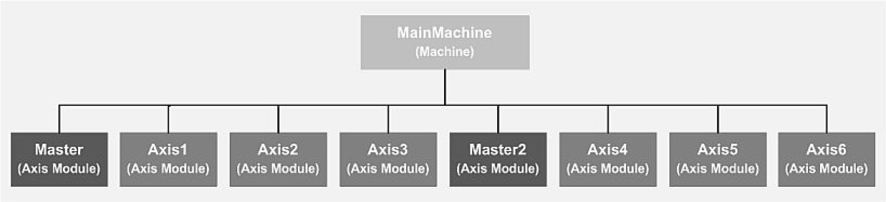
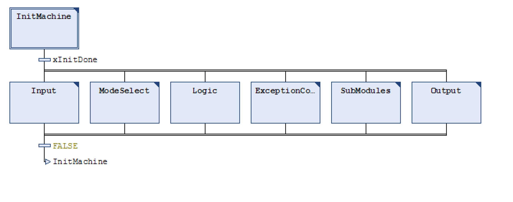

# QuickMotionProgramming - Overview

## General

The project "QuickMotionProgramming" is an easy to use example with a MainMachine and eight axes modules.

It is available after installation of the seco package SoMachine Motion V4.0 Patch 1.

You can call up the demo project by selecting the project template QuickMotionProgramming via New Project > With template > Tab General.

Further information on using templates can be found in the online help under Programming with EcoStruxure Machine Expert > Get Started Screen > New Project Assistant - Templates

The following subchapters describe the program examples from the demo project in more detail:

## Overview

The project template QuickMotionProgramming is an easy to use example with a main machine and eight axis modules.

Structure of MainMachine:

The objective of this project template is an easy access to the high performance environment for high performance beginners. This ready to run example allows you to get a simple machine up and running in a short time.

This ready to run project is provided to be used as a template to get started. Instead of starting from scratch you start with a prepared project and can adjust this project to the needs of your machine.

The example supports the hardware according to the **Training and Test System PacDrive 3** (in short: TTS3) with PacDrive LMC101/Lexium 52 which includes anPacDrive LMC101 and two Lexium 52. For detailed information on the Training and Test System PacDrive 3, refer to the supplied operating manual.

In the QuickMotionProgramming project, the HMI application is created with the Logic Builder. If you want to use Vijeo-Designer for the creation of the visualization, refer to the Vijeo Designer online help for detailed information.

This example is intended to get you started quickly. If you are interested in further, fundamental information on the subject, consider the Machine Solutions training courses offered by Schneider Electric Training (see [www.se.com](https://www.se.com) or contact your Schneider Electric representative).

## Programm Structure of the MainMachine

The following graphic shows the basic structure of the MainMachine:

| Action | Description |
| --- | --- |
| `InitMachine` | This action is dedicated to initialise the variables for the programm instruction once only right after starting the project.  The further actions (Input, ModeSelect, Logic, ExceptionControl, SubModules and Output) contain the instructions. |
| `Input` | This action calls update functions and functions to detect changes.  It is called cyclically after the action InitMachine has been finished.  This part collects all commands from an external HMI, the visualization, fieldbus and inputs. |
| `ModeSelect` | This action handles the operation modes of the axis Prepare, Auto, Manual.  It is called cyclically after the action InitMachine has been finished.  In the operation mode Auto is for the axis endless and camming are defined by default mode. |
| `Logic` | This action is reserved for user programming code.  It is called cyclically after the action InitMachine has been finished. |
| `ExceptionControl` | This action is implementing all about the exception handling and logging.  It is called cyclically after the action InitMachine has been finished. |
| `SubModules` | This action is calling the eight axis modules and the module controller.  It is called cyclically after the action InitMachine has been finished.  The action must only be changed if more or less than 8 axis are defined. Otherwise there are no changes needed in this action. |
| `Output` | This action sends the project information to the outputs of the controller, via the fieldbus, to HMI or visualisation.  It is called cyclically after the action InitMachine has been finished.  As example a running light with TM5 IOs is implemented by default. |

EIO0000002668.01

© 2022

Schneider Electric.

All rights reserved.