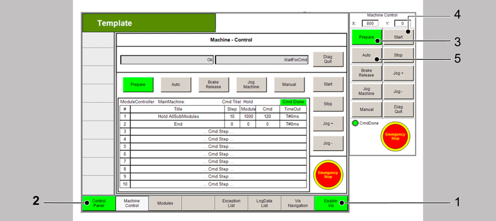
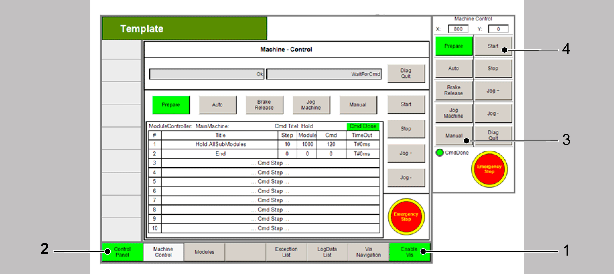
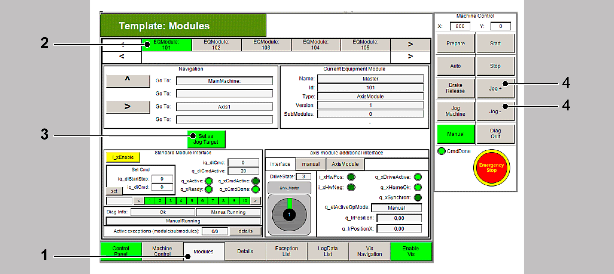

# Setting Up and Starting the TTS 3 PacDrive LMC101/Lexium 52 System

## General

The following chapter explains how to set up and start a system.

The described processes are intended for a Training and Test System PacDrive 3 with PacDrive LMC101/Lexium 52.

The modifications are for use with physical axes and predefined I/O wiring according to the supplied operating manual.

NOTE: Before performing the steps described in the following chapter, refer to the supplied operating manual for detailed information on the Training and Test System PacDrive 3.

The following adjustments are necessary before the program can be started on the TTS 3 system:

* Configuring the program

  + Enabling the watchdog (WDOutEnable to on/1)
  + Setting the test switch for the axes

    (For detailed information on the Training and Test System PacDrive 3, refer to the supplied operating manual, chapter Firmware and software).
* Mapping a virtual axis to a physical axis

The following topics explain how to perform these adjustments and start the project on the TTS3 system:

## Configuring the Program for the Training System

This topic explains how to configure the program for the training system TTS3 PacDrive LMC101/Lexium 52 after successfully compiling your program:

**Enabling the watchdog**

| Step | Action |
| --- | --- |
| 1 | In the Devices tree, double-click DQ\_WD. |
| 2 | In the DQ\_WD tab, set the value of WDOutEnable to on/1.    Now the special output DQ\_WD is configured as a WatchDog output. It is no longer possible to use this output as normal digital output. Instead this output disables now all axes as long as the controller is not ready. |

**Setting the test switch for the axes of the TTS3** PacDrive LMC101**/**Lexium 52 **system**

For detailed information on the Training and Test System PacDrive 3, refer to the supplied operating manual, chapter Firmware and software.

**Preparing another axis for a physical axis**

In the QuickMotionProgramming project, the setting of the test switch for the axes has already been performed for the axes DRV\_Master and DRV\_Axis1.

If you want to use another axis as a physical axis on the trainings system, for example DRV\_Axis2, proceed as described in the following procedure:

| Step | Action |
| --- | --- |
| 1 | Set the test switch for DRV\_Axis2 as described in the supplied operating manual, chapter Firmware and software. |
| 2 | In the Devices tree, right-click the drive, for example, DRV\_Master and select Add Device > On Board I/O to add onboard I/Os to the axis. |
| 3 | In the Devices tree, double-click LXMx2IO\_InOutTP (under the drive DRV\_Axis2) to set the I/O Mode. |
| 4 | In the Configuration tab, set the value of the parameter IO0\_Mode to Touchprobe /1. |
| 5 | Double-click on Init\_Axis2 action of the axis to make sure that the Homing mode is set to PosDirectionPosEdgeTP. |
| 6 | In the Init\_Axis2 action, set the sensor for homing.  For example: stAxis2Interface.stHome.stTouchProbe.i\_ifTouchProbe := TP\_0\_2; |

## Mapping a Virtual Axis to a Physical Axis

By default, the axes in the project are virtual. The following topic explains how to map these virtual axes to the devices connected to the Sercos III bus by using the Device Addressing tab.

After successfully compiling your program, map the virtual axis to the physical axis as described below:

| Step | Action |
| --- | --- |
| 1 | Switch from the Devices tree to the Tools tree, double-click Device Addressing to open the device addressing.    The Device Addressing tab is displayed. |
| 2 | In the Device Addressing tab, click Start SERCOS scan. |
| 3 | In the displayed safety prompt, click Yes to accept the Sercos scan. |
| 4 | In the drop-down menu Scanned devises, choose the required device. |
| 5 | Click the arrow to the left of the Scanned devices drop-down menu or click Adopt values of all assigned devices to map the devices to the IEC identifier. |
| 6 | Execute the command Online > Login, or click the Login button  from the toolbar, or press **ALT** + **F8** to log in. |
| 7 | In the displayed dialog, choose the option Log in with download and click Ok to download the project code to the controller and log in. |
| 8 | Click Cold reset of controller to restart the PacDrive LMC. |

## Starting the Operation of the Project

This topic explains how to start the operation of the project by using the template visualization.

**Opening the visualization**

| Step | Action |
| --- | --- |
| 1 | In the Tools tree, double-click VIS\_Main to open the visualization. |
| 2 | The following visualization is displayed: |

**Bringing the program into mode Auto**

In the template, first start the mode Prepare and then the mode Auto as instructed below:

| Step | Action |
| --- | --- |
| 1 | Click Enable Vis to activate the visualization (point 1). |
| 2 | Click Control Panel to switch to the Control Panel (point 2). |
| 3 | Click Prepare to select the mode Prepare (point 3). |
| 4 | Click Start to start the mode Prepare (point 4). |
| 5 | Click Auto to switch to the mode Auto (point 5). |
| 6 | Click Start to start the mode Auto (point 4). |

## Jogging an Axis

This topic explains how to bring the program into the operation mode Manual and how to jog an axis via the template visualization.

**Bringing the program into the mode Manual**

In the template, first start the mode Prepare and then the mode Manual as instructed below:

| Step | Action |
| --- | --- |
| 1 | Click Enable Vis to activate the visualization (point 1). |
| 2 | Click Control Panel to switch to the Control Panel (point 2). |
| 3 | Click Manual to switch to the mode Manual (point 3). |
| 4 | Click Start to start the mode Manual (point 4). |

**Jogging an axis**

In the template visualization, navigate to a module and jog an axis as instructed below:

| Step | Action |
| --- | --- |
| 1 | Click Modules to activate the modules view (point 1). |
| 2 | Click EQModule: 101 to switch to the first equipment module which controls the axis DRV\_Master (point 2). |
| 3 | Click Set as Jog Target to set this axis as jog target (point 3). |
| 4 | Click Jog+ or Jog- to jog the axis (point 4). |

EIO0000002668.01

© 2022

Schneider Electric.

All rights reserved.