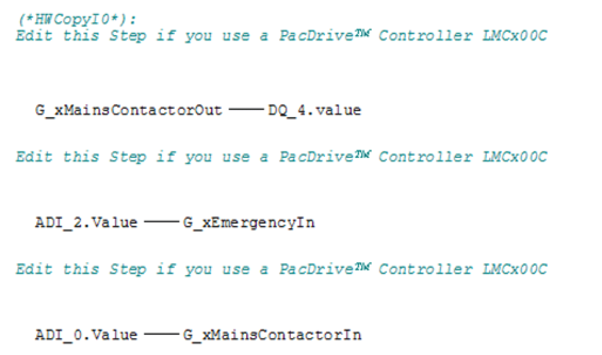

# Changing the Device Controller

## General

The QuickMotionProgramming project is intended for the device PacDrive LMC x01C. If you want to use another controller type, you can convert the device as decribed in the following procedure.

The following procedure explains how to change the device controller from PacDrive LMC x01C to PacDrive LMC x00C:

| Step | Action |
| --- | --- |
| 1 | In the Device tree, right-click on the device you want to convert, in our example LMC\_PacDrive (PacDrive LMC x01C) and select Convert Device. |
| 2 | In the Convert device dialog, choose the device PacDrive LMC x00C and click OK to complete the conversion. |
| 3 | In the displayed safety prompt, click Yes to accept the conversion of the device. |

After the successful conversion of the device, the following steps must be performed:

| Step | Action |
| --- | --- |
| 1 | In the Device tree, double-click DQG\_DigitalOut. |
| 2 | In the displayed Configuration tab of the DQG\_DigitalOut tab, edit the value of the parameter OpenloadDiagMskSet to 0. |
| 3 | The assignment of the inputs and outputs in the QuickMotionProgramming project is intended for the TTS3 PacDrive LMC101/Lexium 52 system. (For detailed information on the assignment of the inputs and outputs of the Training and Test System PacDrive 3, refer to the supplied operating manual, chapter Assignment of inputs and outputs.  If you want to use another system, the hardware copy IO (HWCopyIO) must be adjusted according to the assignment of the inputs and outputs:  In the Applications tree (or in the Devices tree, if you use the Classic Navigation view), select the Input\_action of the MainMachine and edit the HWCopyIO: |

EIO0000002668.01

© 2022

Schneider Electric.

All rights reserved.