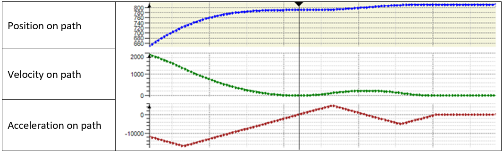
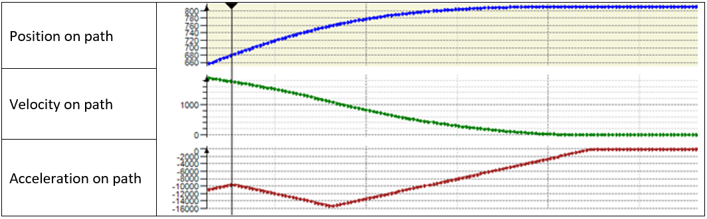

# V2.4.2.0

## System Requirements

Using the library with other versions of software or firmware may have results other than those described in the present documentation.

| WARNING | |
| --- | --- |
|  | UNINTENDED EQUIPMENT OPERATION  * Ensure that the software and firmware are of the versions supported by this library. * Contact your Schneider Electric service representative for compatibility information.  Failure to follow these instructions can result in death, serious injury, or equipment damage. |

## Supported Hardware

* PacDrive LMC Eco
* PacDrive LMC Pro
* PacDrive LMC Pro2

## Software Requirements

* SoMachine Motion V4.3 SP1

## Firmware Requirements

PacDrive 3 V4.3 SP1

* PacDrive LMC Eco V1.54.20.3 or greater
* PacDrive LMC Pro V1.54.20.3 or greater
* PacDrive LMC Pro2 V1.54.20.3 or greater

## New Functions

In several situations, the velocity of the path movement gets zero during the movement.

Situations

1. The path movement of the robot is in the deceleration phase to its end position. A motion command IF\_RobotMotion.MoveL(…), IF\_RobotMotion.MoveC(…), or IF\_RobotMotion.MoveS(…) is sent to extend the path movement of the robot.
2. A IF\_RobotMotion.SetStopOnPath(…) command is active and the path movement of the robot is in the deceleration phase to the stop position on path. The stop-on-path is reset by the IF\_RobotMotion.ResetStopOnPath(…) command.
3. The parameter IF\_RobotMotion.lrVelOverride was set to 0.0 and the path movement of the robot is in the deceleration phase to stop-on-path. The parameter IF\_RobotMotion.lrVelOverride is set to a value greater than 0.0.
4. FB\_Robot.xStart was set to FALSE and the path movement of the robot is in the deceleration phase to stop-on-path. FB\_Robot.xStart is set to TRUE again.

   If it is possible, a motion profile is calculated without zero velocity during the path movement.

If it is possible, a motion profile is calculated without zero velocity during the path movement.

## Modifications

* None

## Enhancements

* In several situations, the diagnostic message ET\_Diag.UnexpectedProgramBehavior was returned by the robot in connection with calculating the estimated stop position of the TCP on the connected path. Calculating the estimated stop position is improved.
* If a ColdStart of the robot is performed, a previously asynchronous movement of an auxiliary axis is cleared.
* If IF\_RobotMotion.ClearSegmentsFromId(i\_udiSegmentId := 0) is called to clear all motion jobs, all Tracking- or MoveAsync-events also cleared.
* If the tracking direction of a linear tracking system is configured to ET\_RobotComponent.CartesianY or ET\_RobotComponent.CartesianZ, modifying the linear tracking system by calling IF\_RobotConfigurationAdvanced.ModifyCoordinateSystem2(…) is fully supported.

EIO0000002232.23