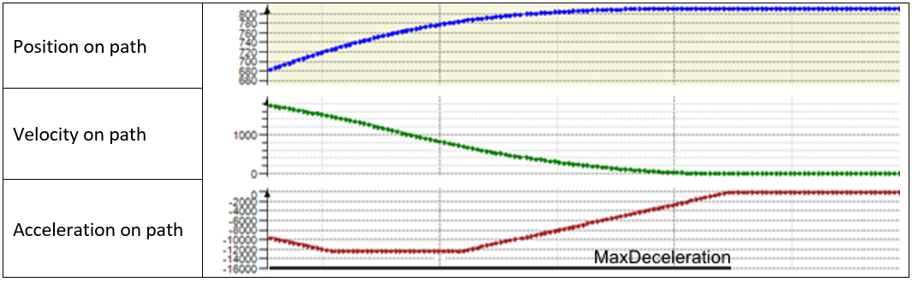

# V2.6.1.0

## System Requirements

Using the library with other versions of software or firmware may have results other than those described in the present documentation.

| WARNING | |
| --- | --- |
|  | UNINTENDED EQUIPMENT OPERATION  * Ensure that the software and firmware are of the versions supported by this library. * Contact your Schneider Electric service representative for compatibility information.  Failure to follow these instructions can result in death, serious injury, or equipment damage. |

## Supported Hardware

* PacDrive LMC Eco
* PacDrive LMC Pro
* PacDrive LMC Pro2

## Software Requirements

* SoMachine Motion V4.3 SP1

## Firmware Requirements

PacDrive 3 V4.3 SP1

* PacDrive LMC Eco V1.54.20.3 or greater
* PacDrive LMC Pro V1.54.20.3 or greater
* PacDrive LMC Pro2 V1.54.20.3 or greater

## New Functions

* Linear Tracking System

  + IF\_RobotConfiguration.AddLinearTrackingSystem3(…)

    By using this method to configure a linear tracking system, it is possible to define the system ID.
* Additional Transformation TCP

  + IF\_RobotConfigurationAdvanced.AdditionalTransformationTCP(…)

    An additional user-defined transformation for the TCP can be configured.
* Resulting Acceleration Limitation Parameters

  + IF\_RobotConfigurationAdvanced.SetResAccLimitParameters(…)

    Additional configuration parameters for the functionality to limit the resulting acceleration of a robot space movement can be set.
  + IF\_RobotConfigurationAdvanced.GetResAccLimitParameters(…)

    Additional configuration parameters for the functionality to limit the resulting acceleration of a robot space movement can be read.
* Estimated Stop Position AuxAx

  + IF\_RobotFeedbackMotionAuxiliaryAxis.lrEstimatedStopPosition

    Returns the estimated stop position of an active movement of an auxiliary axis.
* Target Extension of a Connected Path

  In several situations, the velocity of the path movement gets zero during the movement.

  

  Situations:

  1. The path movement of the robot is in the deceleration phase to its end position. A motion command IF\_RobotMotion.MoveL(…), IF\_RobotMotion.MoveC(…), or IF\_RobotMotion.MoveS(…) is sent to extend the path movement of the robot.
  2. A IF\_RobotMotion.SetStopOnPath(…) command is active and the path movement of the robot is in the deceleration phase to the stop position on path. The stop-on-path is reset by the IF\_RobotMotion.ResetStopOnPath(…) command.
  3. The parameter IF\_RobotMotion.lrVelOverride was set to 0.0 and the path movement of the robot is in the deceleration phase to stop-on-path. The parameter IF\_RobotMotion.lrVelOverride is set to a value greater than 0.0.
  4. FB\_Robot.xStart  was set to FALSE and the path movement of the robot is in the deceleration phase to stop-on-path. FB\_Robot.xStart is set to TRUE again.

  If it is possible, a motion profile is calculated without zero velocity during the path movement.

  

## Modifications

* License Points

  License points are no longer required by the following functions:

  + FB\_Robot
  + IF\_RobotConfiguration.Delta2Ax
  + IF\_RobotConfiguration.Delta3Ax
  + IF\_RobotConfiguration.Articulated2Ax
  + IF\_RobotConfiguration.SchneiderElectricRobot
* Transform Coordinate

  The Application Logger entry of a successful call of the method IF\_RobotMotion.TransformCoordinate(…) is removed.

## Enhancements

* Calculating the Estimated Stop Position

  + Under certain conditions, the diagnostic message ET\_Diag.UnexpectedProgramBehavior was returned by the robot during calculating the estimated stop position of the TCP on the connected path.

    Calculating the estimated stop position is improved.
* Calculating a Motion Profile

  + Under certain conditions, the diagnostic message ET\_Diag.UnexpectedProgramBehavior was returned by a move command (MoveL, MoveS, MoveC) in connection with calculating the motion profile of the connected path.
  + Under certain conditions, the diagnostic message ET\_Diag.ExecutionAborted - ET\_DiagExt.SwitchTimeInvalid was returned by the robot.
  + Under certain conditions, the diagnostic message ET\_Diag.ExecutionAborted - ET\_DiagExt.PathPositionEndExceeded was returned by the robot.

  Calculating the motion profile is improved.
* Software Watchdog Caused by Calculating Spline Points

  + FB\_EllipticSpline.CalcSplineExtended(…)

    Calling this method could lead into a software watchdog.

    Calculating spline points is improved.
* Hardware Watchdog Caused by Enabling the Robot

  + FB\_Robot.xEnable TRUE -> FALSE

    Enabling the robot could lead into a hardware watchdog.

    Enabling the robot is improved.
* Target Position of Connected Path Not Reached

  + Under certain conditions, the target position of a connected path has not been reached.

    IF\_RobotFeedback.xInMotion returns FALSE, but IF\_RobotFeedback.xInTarget returns not TRUE.

    Reaching the target position of a connected path is improved.
* Stop on Path

  + IF\_RobotMotion.SetStopOnPath(…)

    The method can be called successfully even if IF\_RobotMotion.lrVelOverride was set to 0.0.

    Calling the method is improved.
* Calculating an Elliptic Spline

  FB\_EllipticSpline.CalcFullSpline(…)

  The method returns the correct spline points even if a working plane is configured and the method is called more than once without any change of the input parameters.

  Calculating an elliptic spline is improved.
* Sercos Write Cycle Overflow

  FB\_Robot.xEnable TRUE -> FALSE

  Under certain conditions, the diagnostic message 8507 Sercos write cycle overflow was caused by disabling the robot.

  Disabling the robot is improved.

EIO0000002232.23