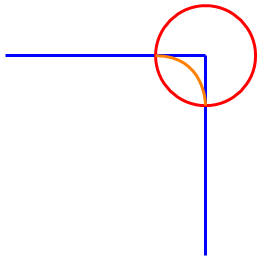

# V2.14.0.0

## System Requirements

Using the library with other versions of software or firmware may have results other than those described in the present documentation.

| WARNING | |
| --- | --- |
|  | UNINTENDED EQUIPMENT OPERATION  * Ensure that the software and firmware are of the versions supported by this library. * Contact your Schneider Electric service representative for compatibility information.  Failure to follow these instructions can result in death, serious injury, or equipment damage. |

## Library Information

Version identification

| Description | Version |
| --- | --- |
| Robotic | V2.14.0.0 |

## Hardware/Firmware Information

SoMachine Motion V4.4 SP1

Version identification

| Description | Version |
| --- | --- |
| PacDrive LMC Eco | V1.56.21.13 or greater |
| PacDrive LMC Pro | V1.56.21.13 or greater |
| PacDrive LMC Pro2 | V1.56.21.13 or greater |

EcoStruxure Machine Expert V1.2

Version identification

| Description | Version |
| --- | --- |
| PacDrive LMC Eco | V1.62.5.4 or greater |
| PacDrive LMC Pro | V1.62.5.4 or greater |
| PacDrive LMC Pro2 | V1.62.5.4 or greater |

## Software Information

Version identification

| Description | Version |
| --- | --- |
| SoMachine Motion | V4.4 SP1 |

For the related hardware/firmware information, see above.

Version identification

| Description | Version |
| --- | --- |
| EcoStruxure Machine Expert | V1.2 |

For the related hardware/firmware information, see above.

## New Features

* [**IF\_RobotConfigurationAdvanced.xUseEStopParameterForEstimatedStopPosition**](D-SE-0075531.html#D-SE-0075531__D-SE-0075531.6)

  After the configuration property is set to TRUE, the feedback of the estimated stop position is calculated based on the configured emergency parameters for path movement.

  Affected feedback of estimated stop position:

  + IF\_RobotFeedback.ifSpace.rstEstimatedStopPosition
  + IF\_RobotFeedBack.ifTrajectoryStorage.ifSpace.rstEstimatedStopPosition
* [**IF\_RobotConfigurationAdvanced.SetTrackingParameters(…) and IF\_RobotConfigurationAdvanced.GetTrackingParameters(…)**](D-SE-0075531.html#D-SE-0075531__D-SE-0075531.5)

  The methods can be used to apply a set of parameters or retrieve a set of parameters of a tracking system.

  Introduced tracking parameter ST\_TrackingParameters.lrAccelerationZeroThreshold:

  This value defines an acceleration limit for a tracking system. For accelerations below this limit, the state of the tracking system is treated as constant velocity or standstill during desynchronization phase.

## Mitigated Anomalies

* **Feedback of present segment fixed in case of ResultantAccelerationLimitation is configured**

  The properties lrLength, lrRefPosition, and lrDistanceToEnd return the correct values now.

  The shortening of blending zones is taken in to account now.

  For the ResultantAccelerationLimitation, the correct length of the correct path is calculated. For the blending zones this usually means, that the path along the arc is shorter.

  

  In the example above, two segments with a length of 200 mm each are connected with a blending zone of 50 mm. Without ResultantAccelerationLimitation, the connected path has a length of 400 mm and both segments report a length of 200 mm. When ResultantAccelerationLimitation is configured, the length of the orange arc is calculated. Thus, the length of the connected path is only 382.52 mm.

  The segment length is now adopted and displays 191.26 mm instead of 200 mm. Furthermore lrRefPosition and lrDistanceToEnd, which refer to the segment length, are returning the correct values now.
* **Asynchronous auxiliary axis or orientation movement after a warm start**

  + An already triggered asynchronous auxiliary axis or orientation movement will be finished now after a warm start of the robot is performed.
  + If an auxiliary axis or orientation movement reached its target during a stop or an emergency stop of the robot a new movement is performed after restart or warm start now.

EIO0000002232.23