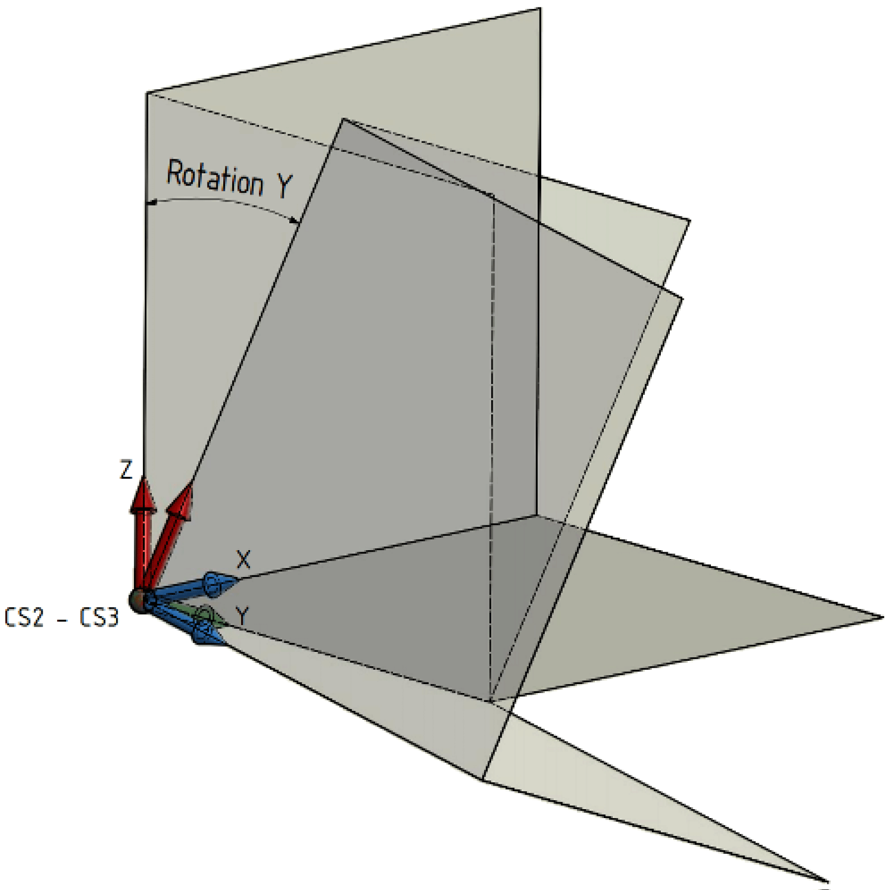

# ET\_OrientationConvention - General Information

## Overview

|  |  |
| --- | --- |
| Type: | Enumeration type |
| Available as of: | V1.6.0.0 |

## Description

Convention for the rotation angles of an orientation.

## Enumeration Elements

| Name | Value | Description |
| --- | --- | --- |
| None | 0 | The convention for the rotation angles is not set. |
| XYZ | 1 | The convention for the rotation angles is X - Y` - Z``. |
| ZYX | 2 | The convention for the rotation angles is Z - Y` - X``. |
| ZXY | 3 | The convention for the rotation angles is Z - X` - Y``. |

Execution sequence of the rotation angles of an orientation of a coordinate system:

In this example, the orientation convention is ET\_OrientationConvention.XYZ.

| 1 | Rotation of the coordinate system CS1 around its X axis. This creates the coordinate system CS2. |

| 2 | Rotation of the coordinate system CS2 around its Y axis. This creates the coordinate system CS3. |

| 3 | Rotation of the coordinate system CS3 around its Z axis. This creates the coordinate system CS4. |

EIO0000002232.23