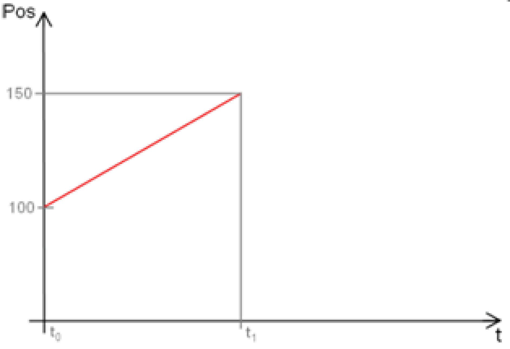
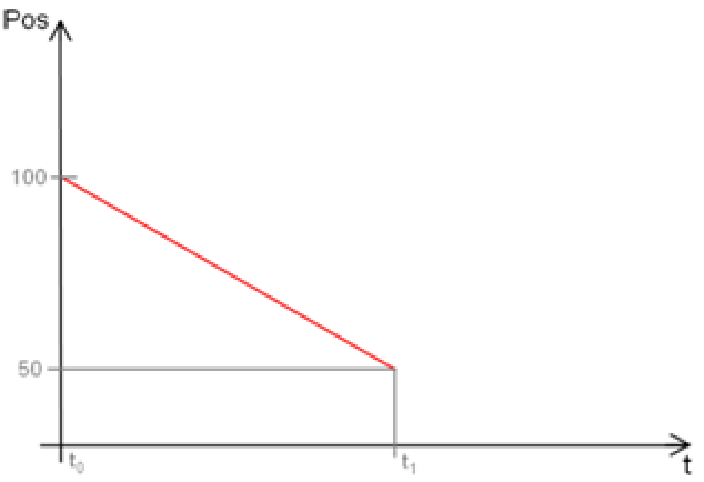
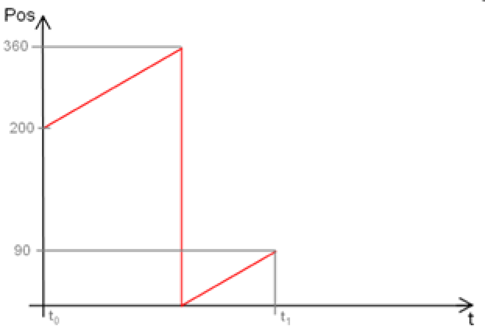
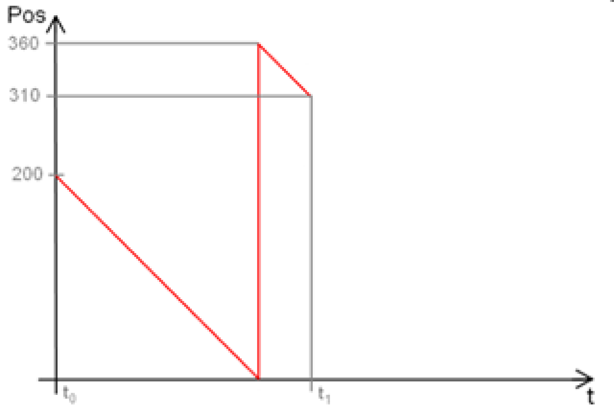
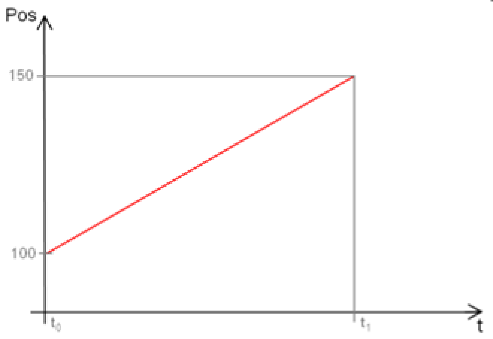
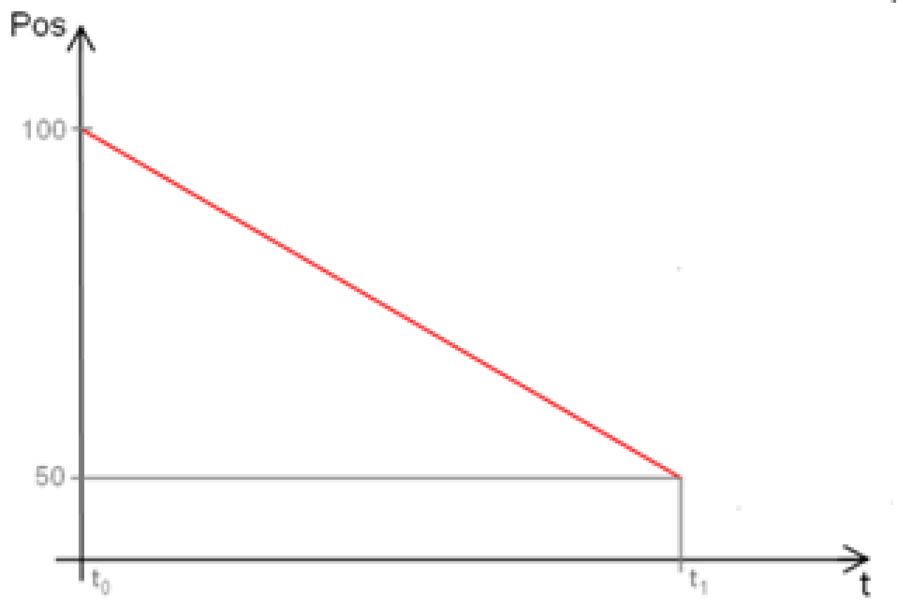
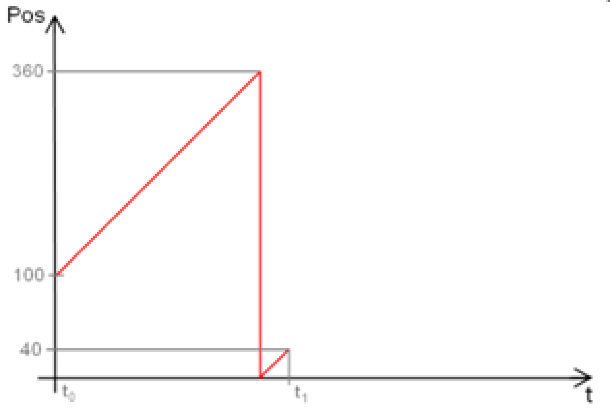
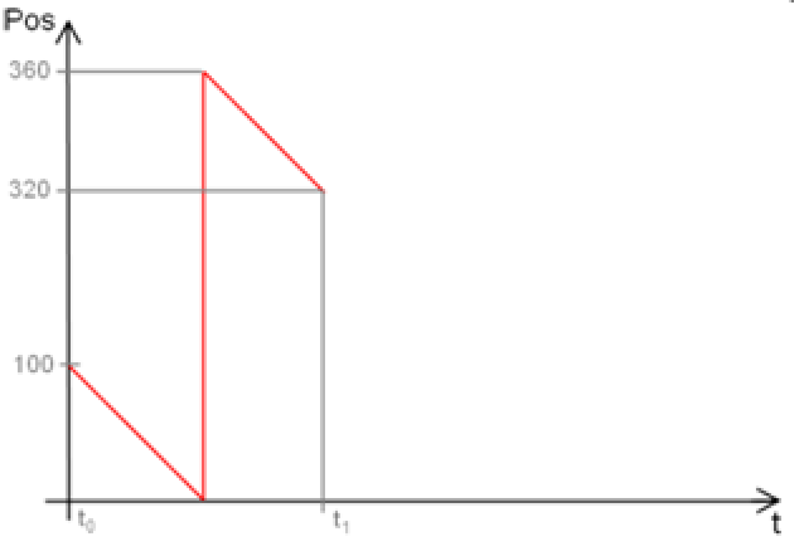

# ET\_PositioningMode - General Information

## Overview

|  |  |
| --- | --- |
| Type: | Enumeration type |
| Available as of: | V1.0.0.0 |

## Description

The enumeration type to specify the motion mode.

## Enumeration Elements

| Name | Value | Description |
| --- | --- | --- |
| Relative | 0 | [Relative positioning](#D-SE-0075487__D-SE-0075487.5) |
| Absolute | 1 | [Absolute positioning](#D-SE-0075487__D-SE-0075487.6) |
| PeriodicShort | 2 | [Shortest movement within the configured period](#D-SE-0075487__D-SE-0075487.7) |

## Relative

**Relative motion without period**

The axis is on the position 100.

You would like to move +50 units. -> The axis moves forwards to the position 150.

You would like to move -50 units. -> The axis moves backwards to the position 50.

**Relative motion with period (endless behavior)**

The axis has a period 0...360 degrees.

The axis is on the position 200.

You would like to move by +250 degrees. -> The axis moves forwards to the position 90.

You would like to move by -250 degrees. -> The axis moves backwards to the position 310.

## Absolute

**Absolute motion without period**

The axis is on the position 100.

You would like to move to the position 150. -> The axis moves forwards to the position 150.

You would like to move to the position 50. -> The axis moves backwards to the position 50.

**Absolute motion with period (endless behavior)**

The axis has a period 0...360 degrees.

The axis is on the position 100.

You would like to move forwards to the position 400. -> The axis moves forwards to the position 40.

You would like to move backwards to the position -40. -> The axis moves backwards to the position 320.

## PeriodicShort

The positioning mode PeriodicShort calculates and uses the shortest distance between a start position and a target position for synchronous and asynchronous movements of a periodic auxiliary axis.

The target position is calculated into the period of the axis. The resulting position replaces the target position transferred by you.

The selected axis must have a configured period length that is greater than 0.

Since the orientation (SCARA) is not periodic, the positioning mode PeriodicShort is not available for calls of the method MoveSync() and MoveAsync() with the input i\_etComponent = ET\_RobotComponent.OrientationX...ET\_RobotComponent.OrientationZ.

Case 1: PeriodicShort results in a forward movement (PeriodicShort versus Absolute)

The axis has a period of 0...360 degrees.

The axis is on the position 320. To move to the position 20, the axis moves forward.

|  |  |
| --- | --- |
|  |  |

Case 2: PeriodicShort results in a backward movement (PeriodicShort versus Absolute)

The axis has a period of 0...360 degrees.

The axis is on the position 100. To move to the position 20, the axis moves backward.

|  |  |
| --- | --- |
|  |  |

EIO0000002232.23