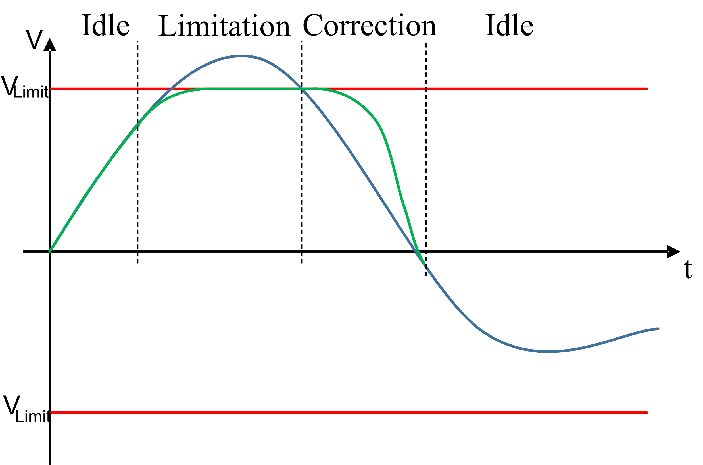

# ET\_VelocityLimitationMode - General Information

## Overview

|  |  |
| --- | --- |
| Type | Enumeration type |
| Available as of: | V2.5.0.0 |

## Description

Enumeration type to describe the velocity limitation mode.

## Enumeration Elements of IF\_RobotFeedbackVelocityLimitation

| Name | Value | Description |
| --- | --- | --- |
| Off | 0 | The limitation of the velocity for axes is not active. |
| Idle | 1 | The limitation of the velocity for one or more axes is active but no limitation is necessary. |
| Limitation | 2 | One or more axes are in limitation mode. |
| Correction | 3 | One or more axes are in correction mode, but none is in limitation mode. |

## Enumeration Elements of IF\_RobotFeedbackVelocityLimitationAxis

| Name | Value | Description |
| --- | --- | --- |
| Off | 0 | The limitation of the velocity for this axis is not active. |
| Idle | 1 | The limitation of the velocity for the axis is active but no limitation is necessary. |
| Limitation | 2 | The axis is in limitation mode. |
| Correction | 3 | The axis is in correction mode. |

## Operating Modes

| Operating mode | Description |
| --- | --- |
| Off | The limitation of the velocity for axes is not configured; the limitation is not active and there is no monitoring of the axis velocity. |
| Idle | The limitation of the velocity for axes is configured. The monitoring of the axis velocity is active, but there is no need for a limitation. Thus, there is no modification to the axis reference values. |
| Limitation | When monitoring detects that the axis RefVelocity might exceed the given limit, the acceleration is reduced and the velocity is capped at the limit. The functionality keeps this mode until the RefVelocity drops below the limit. As soon as this condition is detected, the functionality switches to the correction mode. |
| Correction | The position deviation that is built up during the limitation phase is now compensated. Therefore, the axis keeps the velocity at the limit if possible and blends back to the given RefVelocity to resynchronize to the regular movement. When the correction is finished, the functionality returns to idle mode. |

## Feedback

The mode displayed in the axis feedback is the current mode of the functionality for this axis.

The mode in the common feedback IF\_RobotFeedbackVelocityLimitation shows a summary:

| Number of axes in mode: | | | | |
| --- | --- | --- | --- | --- |
| Off | Idle | Limitation | Correction | Summary |
| All axes | None | None | None | Off |
| Any number | One or more | None | None | Idle |
| Any number | Any number | One or more | Any number | Limitation |
| Any number | Any number | None | One or more | Correction |

EIO0000002232.23