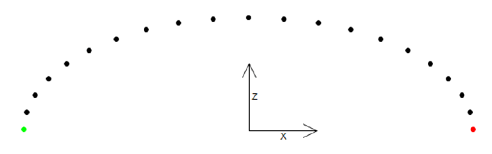

# FB\_EllipticSpline - CalcFullSpline (Method)

## Overview

|  |  |
| --- | --- |
| Type: | Method |
| Available as of: | V1.4.1.0 |

This chapter provides information on:

* [Task](#D-SE-0075498__D-SE-0075498.3)
* [Description](#D-SE-0075498__D-SE-0075498.4)
* [Interface](#D-SE-0075498__D-SE-0075498.5)
* [Diagnostic Messages](#D-SE-0075498__D-SE-0075498.6)

## Task

Calculating spline points for an elliptic spline.

## Description

Based on the inputs i\_stStart, i\_stTarget, i\_lrAbsHeight and on the value of the property udiNumberOfSplinePoints, this method calculates a position table for a spline interpolation in three-dimensional space. Traveling along these positions can be realized by using the IF\_RobotMotion.MoveS motion command. A position table is calculated from the start position to the target position as well as from the target position to the start position. For this purpose, two ellipse-shaped half branches are calculated: from the start position to the apex and from the apex to the target position. The apex is calculated such that the bend of the two half branches in this point is equal.

Full spline from start position to target position:

## Interface

| Input | Data type | Description |
| --- | --- | --- |
| i\_stStart | [PDL.ST\_Vector3D](../../../../../api/crossBook?lang=en-US&virtualBookName=PD.Lib.PacDriveLib&topicID=D_SE_0087802) | Start position in cartesian coordinates  Value range: i\_stStart.lrX / lrY <> i\_stTarget.lrX / lrY |
| i\_stTarget | [PDL.ST\_Vector3D](../../../../../api/crossBook?lang=en-US&virtualBookName=PD.Lib.PacDriveLib&topicID=D_SE_0087802) | Target position in cartesian coordinates  Value range: i\_stStart.lrX / lrY <> i\_stTarget.lrX / lrY |
| i\_lrAbsHeight | LREAL | Absolute height of the elliptic spline apex.  Value range: i\_lrAbsHeight > i\_stStart.lrZ AND i\_lrAbsHeight > i\_stTarget.lrZ |

| Output | Data type | Description |
| --- | --- | --- |
| q\_etDiag | [GD.ET\_Diag](../../../../../api/crossBook?lang=en-US&virtualBookName=PD.Lib.GlobalDiagnostic&topicID=D_SE_0076228) | General library-independent statement on the diagnostic.  A value not equal to ET\_Diag.Ok corresponds to a diagnostic message. |
| q\_etDiagExt | [ET\_DiagExt](ET_DiagExt-GeneralInformation-CAB158DC.html#ET_DiagExt-GeneralInformation-CAB158DC) | POU-specific output on the diagnostic.  q\_etDiag = ET\_Diag.Ok -> Status message  q\_etDiag <> ET\_Diag.Ok -> Diagnostic message |
| q\_sMsg | STRING[80] | Event-triggered message that gives additional information on the diagnostic state. |
| q\_stForward | [ST\_SplineTable](D-SE-0075607.html#D-SE-0075607) | Calculated spline table from start to end position. |
| q\_stReverse | [ST\_SplineTable](D-SE-0075607.html#D-SE-0075607) | Calculated spline table from end to start position. |
| q\_udiApexIndex | UDINT | Index of the spline point representing the apex of the elliptic spline. |
| q\_lrApexScalingFactor | LREAL | Scaling factor of the automatically calculated apex of the elliptic spline.  A positive value indicates a movement of the apex towards the target position, a negative value towards the start position. |
| q\_lrSplineLength | LREAL | Resulting length of linear connections between the spline points of the elliptic spline. |

## Diagnostic Messages

| q\_etDiag | q\_etDiagExt | Enumeration value | Description |
| --- | --- | --- | --- |
| OK | Ok | 0 | Ok |
| InputParameterInvalid | IdenticalPosition | 163 | The positions are identical. |
| InputParameterInvalid | NumberOfSplinePointsRange | 89 | The number of spline points is out of range. |
| InputParameterInvalid | StartInvalid | 164 | The start position is invalid. |
| InputParameterInvalid | TargetInvalid | 91 | The target is invalid. |

## IdenticalPosition

|  |  |
| --- | --- |
| Enumeration name: | IdenticalPosition |
| Enumeration value: | 163 |
| Description: | The positions are identical. |

| Issue | Cause | Solution |
| --- | --- | --- |
| Calculating the elliptic spline was not successful. | The cartesian components X and Y of the start position (i\_stStart) and of the target position (i\_stTarget) are identical in a range of 0.001. | Ensure that both values are not identical to each other. |

## NumberOfSplinePointsRange

|  |  |
| --- | --- |
| Enumeration name: | NumberOfSplinePointsRange |
| Enumeration value: | 89 |
| Description: | The number of spline points is out of range. |

| Issue | Cause | Solution |
| --- | --- | --- |
| Calculating the elliptic spline was not successful. | The value transferred at the property udiNumberOfSplinePoints lies outside the valid range. | Ensure that udiNumberOfSplinePoints is greater than or equal to 3.  Ensure that udiNumberOfSplinePoints is less than or equal to 98. |

## Ok

|  |  |
| --- | --- |
| Enumeration name: | Ok |
| Enumeration value: | 0 |
| Description: | Ok |

Calculating the elliptic spline was successful.

## StartInvalid

|  |  |
| --- | --- |
| Enumeration name: | StartInvalid |
| Enumeration value: | 164 |
| Description: | The start position is invalid. |

| Issue | Cause | Solution |
| --- | --- | --- |
| Calculating the elliptic spline was not successful. | The method SetWorkingPlane was called and the working plane XY is configured. | Ensure that the input i\_stStart.lrZ is set to 0. |
| The method SetWorkingPlane was called and the working plane XZ is configured. | Ensure that the input i\_stStart.lrY is set to 0. |
| The method SetWorkingPlane was called and the working plane YZ is configured. | Ensure that the input i\_stStart.lrX is set to 0. |

## TargetInvalid

|  |  |
| --- | --- |
| Enumeration name: | TargetInvalid |
| Enumeration value: | 91 |
| Description: | The target is invalid. |

| Issue | Cause | Solution |
| --- | --- | --- |
| Calculating the elliptic spline was not successful. | The method SetWorkingPlane was called and the working plane XY is configured. | Ensure that the input i\_stTarget.lrZ is set to 0. |
| The method SetWorkingPlane was called and the working plane XZ is configured. | Ensure that the input i\_stTarget.lrY is set to 0. |
| The method SetWorkingPlane was called and the working plane YZ is configured. | Ensure that the input i\_stTarget.lrX is set to 0. |

EIO0000002232.23