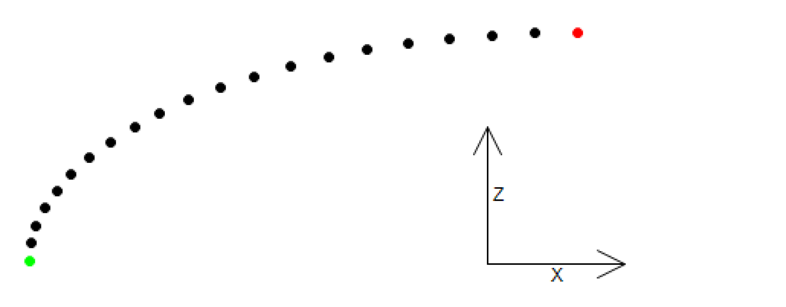
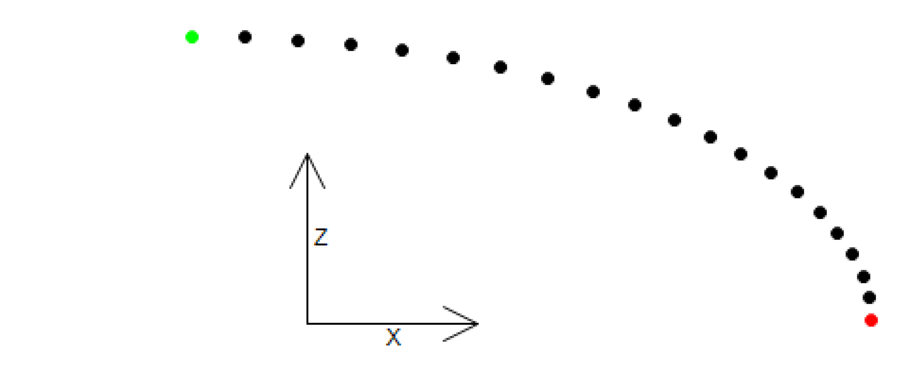

# FB\_EllipticSpline - CalcHalfSpline (Method)

## Overview

|  |  |
| --- | --- |
| Type: | Method |
| Available as of: | V1.4.1.0 |

This chapter provides information on:

* [Task](D-SE-0075501.html#D-SE-0075501__D-SE-0075501.3)
* [Description](#D-SE-0075500__D-SE-0075500.4)
* [Interface](#D-SE-0075500__D-SE-0075500.5)
* [Diagnostic Messages](#D-SE-0075500__D-SE-0075500.6)

## Task

Calculating spline points for an elliptic spline.

## Description

Based on the inputs i\_stStart, i\_stTarget and on the value of the property udiNumberOfSplinePoints, this method calculates a position table for a spline interpolation in three-dimensional space. Traveling along these positions can be realized by using the IF\_RobotMotion.MoveS motion command. A position table is calculated from the start position to the target position as well as from the target position to the start position. For this purpose, one ellipse-shaped half branch is calculated: from the start position down or up to the target position.

Half spline from start position up to target position:

Half spline from start position down to target position:

## Interface

| Input | Data type | Description |
| --- | --- | --- |
| i\_stStart | [PDL.ST\_Vector3D](../../../../../api/crossBook?lang=en-US&virtualBookName=PD.Lib.PacDriveLib&topicID=D_SE_0087802) | Start position in cartesian coordinates  Value range: i\_stStart.lrX / lrY <> i\_stTarget.lrX / lrY |
| i\_stTarget | [PDL.ST\_Vector3D](../../../../../api/crossBook?lang=en-US&virtualBookName=PD.Lib.PacDriveLib&topicID=D_SE_0087802) | Target position in cartesian coordinates  Value range: i\_stStart.lrX / lrY <> i\_stTarget.lrX / lrY |

| Output | Data type | Description |
| --- | --- | --- |
| q\_etDiag | [GD.ET\_Diag](../../../../../api/crossBook?lang=en-US&virtualBookName=PD.Lib.GlobalDiagnostic&topicID=D_SE_0076228) | General library-independent statement on the diagnostic.  A value not equal to ET\_Diag.Ok corresponds to a diagnostic message. |
| q\_etDiagExt | [ET\_DiagExt](ET_DiagExt-GeneralInformation-CAB158DC.html#ET_DiagExt-GeneralInformation-CAB158DC) | POU-specific output on the diagnostic.  q\_etDiag = ET\_Diag.Ok -> Status message  q\_etDiag <> ET\_Diag.Ok -> Diagnostic message |
| q\_sMsg | STRING[80] | Event-triggered message that gives additional information on the diagnostic state. |
| q\_stForward | [ST\_SplineTable](D-SE-0075607.html#D-SE-0075607) | Calculated spline table from start to end position. |
| q\_stReverse | [ST\_SplineTable](D-SE-0075607.html#D-SE-0075607) | Calculated spline table from end to start position. |
| q\_lrSplineLength | LREAL | Resulting length of linear connections between the spline points of the elliptic spline. |

## Diagnostic Messages

| q\_etDiag | q\_etDiagExt | Enumeration value | Description |
| --- | --- | --- | --- |
| OK | Ok | 0 | Ok |
| InputParameterInvalid | IdenticalHeight | 165 | The heights are identical. |
| InputParameterInvalid | IdenticalPosition | 163 | The positions are identical. |
| InputParameterInvalid | NumberOfSplinePointsRange | 89 | The number of spline points is out of range. |

## IdenticalHeight

|  |  |
| --- | --- |
| Enumeration name: | IdenticalHeight |
| Enumeration value: | 165 |
| Description: | The heights are identical. |

| Issue | Cause | Solution |
| --- | --- | --- |
| Calculating the elliptic spline was unsuccessful. | The cartesian component Z of the start position (i\_stStart) and of the target position (i\_stTarget) is identical in a range of 0.001. | Ensure that the values are not identical to each other. |

## IdenticalPosition

|  |  |
| --- | --- |
| Enumeration name: | IdenticalPosition |
| Enumeration value: | 163 |
| Description: | The positions are identical. |

| Issue | Cause | Solution |
| --- | --- | --- |
| Calculating the elliptic spline was unsuccessful. | The cartesian components X and Y of the start position (i\_stStart) and of the target position (i\_stTarget) are identical in a range of 0.001. | Ensure that both values are not identical to each other. |

## NumberOfSplinePointsRange

|  |  |
| --- | --- |
| Enumeration name: | NumberOfSplinePointsRange |
| Enumeration value: | 89 |
| Description: | The number of spline points is out of range. |

| Issue | Cause | Solution |
| --- | --- | --- |
| Calculating the elliptic spline was unsuccessful. | The value transferred at the property udiNumberOfSplinePoints lies outside the valid range. | Ensure that udiNumberOfSplinePoints is greater than or equal to 3.  Ensure that udiNumberOfSplinePoints is less than or equal to 98. |

## Ok

|  |  |
| --- | --- |
| Enumeration name: | Ok |
| Enumeration value: | 0 |
| Description: | Ok |

Calculating the elliptic spline was successful.

EIO0000002232.23