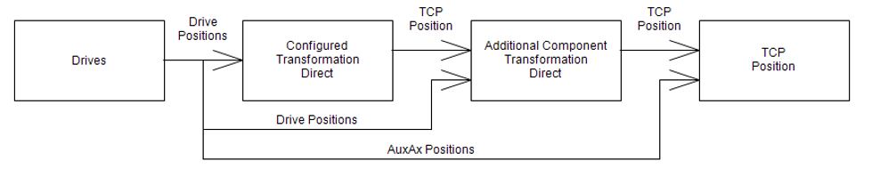
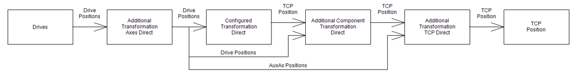

# IF\_AdditionalComponentsTransformation - Direct (Method)

## Overview

|  |  |
| --- | --- |
| Type: | Method |
| Available as of: | V3.6.6.0 |

This chapter provides information on:

* [Task](#IF_AdditionalComponentsTransformati-6B4E8A8F__Task-6B4E7689)
* [Description](#IF_AdditionalComponentsTransformati-6B4E8A8F__Description-6B4E5838)
* [Sequence of Direct Transformation Calls](#IF_AdditionalComponentsTransformati-6B4E8A8F__SequenceOfDirectTransformationCalls-6B5075FC)
* [Interface](#IF_AdditionalComponentsTransformati-6B4E8A8F__Interface-6B4E5463)

## Task

Calculating the direct transformation of the additional components.

## Description

The method is used to calculate the direct transformation of the configured additional components. The inputs i\_stPositionTCP and i\_stOrientationTCP represent the TCP position and orientation calculated by the configured main transformation. i\_alrPositionAxis contains the positions of the drives.

The new TCP position including the values from additonal components must be forwarded to the robot on the outputs q\_stPositionTCP and q\_stOrientationTCP.

In case a component is not affected by the additional transformation, the value for this component must be forwarded from the input to the respective output.

The outputs q\_etDiag, q\_etDiagExt and q\_sMsg can be used to trigger an exception on the robot in case there is any exception detected by the user code implemented in this method. An exception can be triggered by setting the output q\_etDiag to a value not equal to GD.ET\_Diag.Ok.

When a value unequal to zero for a not configured TCP component is calculated and transferred to the robot via the outputs q\_stPositionTCP.lrX / lrY / lrZ or q\_stOrientation.lrX / lrY / lrZ, the robot returns the diagnostic message ET\_Diag.ExecutionAborted / ET\_DiagExt.ComponentNotConfigured.

## Sequence of Direct Transformation Calls

When an additional component transformation is configured, it is called after the main transformation and receives the result of this main transformation as well as the drive positions of the drives A through F.

When all options for the transformation are configured, the direct sequence is as follows:

1. The additional transformation for the axes is called, followed by the main transformation.
2. The additional component transformation is called, and the additional transformation TCP is the last.

## Interface

| Input | Data type | Description |
| --- | --- | --- |
| i\_stPositionTCP | [PDL.ST\_Vector3D](../../../../../api/crossBook?lang=en-US&virtualBookName=PD.Lib.PacDriveLib&topicID=D_SE_0087802) | Position of the TCP from the configured main transformation |
| i\_stOrientationTCP | [PDL.ST\_Vector3D](../../../../../api/crossBook?lang=en-US&virtualBookName=PD.Lib.PacDriveLib&topicID=D_SE_0087802) | Orientation of the TCP from the configured main transformation |
| i\_etOrientationConvention | [ET\_OrientationConvention](D-SE-0075485.html) | Orientation convention |
| i\_alrPositionAxis | ARRAY [ET\_RobotComponent.AxisA .. ET\_RobotComponent.AxisAll +Gc\_udiMaxNumberOfAxes] OF LREAL | Position of the robot axes |

| Output | Data type | Description |
| --- | --- | --- |
| q\_etDiag | [GD.ET\_Diag](../../../../../api/crossBook?lang=en-US&virtualBookName=PD.Lib.GlobalDiagnostic&topicID=D_SE_0076228) | General library-independent statement on the diagnostic.  A value not equal to ET\_Diag.Ok corresponds to a diagnostic message. |
| q\_etDiagExt | [ET\_DiagExt](ET_DiagExt-GeneralInformation-CAB158DC.html#ET_DiagExt-GeneralInformation-CAB158DC) | POU-specific output on the diagnostic.  q\_etDiag = ET\_Diag.Ok -> Status message  q\_etDiag <> ET\_Diag.Ok -> Diagnostic message |
| q\_sMsg | STRING[80] | Event-triggered message that gives additional information on the diagnostic state. |
| q\_stPositionTCP | [PDL.ST\_Vector3D](../../../../../api/crossBook?lang=en-US&virtualBookName=PD.Lib.PacDriveLib&topicID=D_SE_0087802) | Position of the TCP including the additional components |
| q\_stOrientationTCP | [PDL.ST\_Vector3D](../../../../../api/crossBook?lang=en-US&virtualBookName=PD.Lib.PacDriveLib&topicID=D_SE_0087802) | Orientation of the TCP including the additional components |

EIO0000002232.23