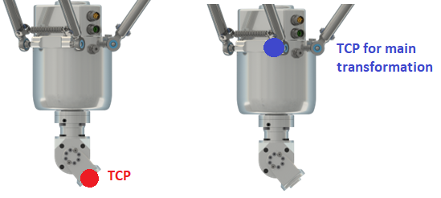
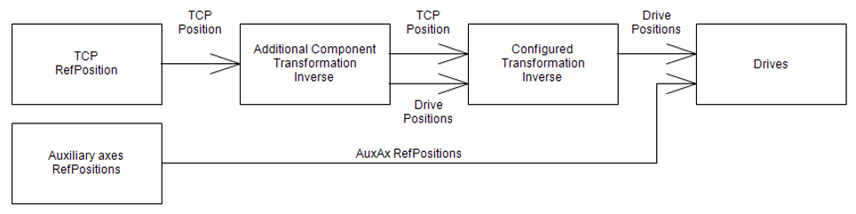
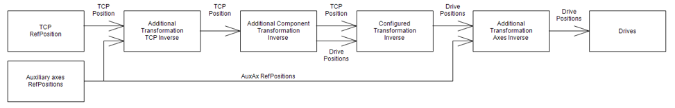

# IF\_AdditionalComponentsTransformation - Inverse (Method)

## Overview

|  |  |
| --- | --- |
| Type: | Method |
| Available as of: | V3.6.9.0 |

This chapter provides information on:

* [Task](#IF_AdditionalComponentsTransformati-6B525564__Task-6B5195DB)
* [Description](#IF_AdditionalComponentsTransformati-6B525564__Description-6B51970F)
* [Sequence of Inverse Transformation Calls](#IF_AdditionalComponentsTransformati-6B525564__SequenceOfInverseTransformationCall-6B54293F)
* [Interface](#IF_AdditionalComponentsTransformati-6B525564__Interface-6B51990D)

## Task

Calculating the inverse transformation of the additional components.

## Description

The method is used to calculate the inverse transformation of the configured additional components. The inputs i\_stRefPositionTCP and i\_stRefOrientationTCP represent the TCP reference position calculated by the trajectory generation.

In case the additional components affect the TCP position and/or orientation, the resulting values must be forwarded to the outputs q\_stRefPositionTCP and q\_stRefOrientationTCP.

For unaffected components the values from the inputs must be forwarded to their respective outputs.

Only the drive positions for the additional components must be written.

The configured main transformation writes the values for its own drives afterwards.

**Example**: For a Delta3 Robot that uses a 4th/5th axes module for rotation and tilting, the additional transformation only must write the axes “D” and “E” as the Delta3 transformation is calculated and written to A, B and C.

In case of the rotational and tilting module, the TCP position must be at the flange of the module. So, the additional component transformation must calculate a modified position for the output q\_stRefPositionTCP that the main transformation uses these values for the calculation.

The outputs q\_etDiag, q\_etDiagExt and q\_sMsg can be used to trigger an exception on the robot in case there is any exception detected by the user code implemented in this method. An exception can be triggered by setting the output q\_etDiag to a value not equal to GD.ET\_Diag.Ok. When a value unequal to zero for a not configured TCP component is calculated and transferred to the robot via the outputs q\_stRefPositionTCP.lrX / lrY / lrZ or q\_stRefOrientation.lrX / lrY / lrZ, the robot returns the diagnostic message ET\_Diag.ExecutionAborted / ET\_DiagExt.ComponentNotConfigured. When a value unequal to zero for a not configured axis is calculated and transferred to the robot via the output q\_alrRefPositionAxis[…], the robot returns the diagnostic message ET\_Diag.ExecutionAborted / ET\_DiagExt.DriveNotConfigured.

## Sequence of Inverse Transformation Calls

The inverse transformation methods are called in the following sequence:

The additional component transformation is called. Its results are forwarded to the main transformation which is called afterwards.

The full sequence with all options starts with the additional transformation TCP call. Next, the additional component transformation is called, followed by the main transformation. The additional transformation axes method is called last.

## Interface

| Input | Data type | Description |
| --- | --- | --- |
| i\_stRefPositionTCP | [PDL.ST\_Vector3D](../../../../../api/crossBook?lang=en-US&virtualBookName=PD.Lib.PacDriveLib&topicID=D_SE_0087802) | Reference position of the TCP |
| i\_stRefOrientationTCP | [PDL.ST\_Vector3D](../../../../../api/crossBook?lang=en-US&virtualBookName=PD.Lib.PacDriveLib&topicID=D_SE_0087802) | Reference orientation of the TCP |
| i\_etOrientationConvention | [ET\_OrientationConvention](D-SE-0075485.html) | Orientation convention |

| Output | Data type | Description |
| --- | --- | --- |
| q\_etDiag | [GD.ET\_Diag](../../../../../api/crossBook?lang=en-US&virtualBookName=PD.Lib.GlobalDiagnostic&topicID=D_SE_0076228) | General library-independent statement on the diagnostic.  A value not equal to ET\_Diag.Ok corresponds to a diagnostic message. |
| q\_etDiagExt | [ET\_DiagExt](ET_DiagExt-GeneralInformation-CAB158DC.html#ET_DiagExt-GeneralInformation-CAB158DC) | POU-specific output on the diagnostic.  q\_etDiag = ET\_Diag.Ok -> Status message  q\_etDiag <> ET\_Diag.Ok -> Diagnostic message |
| q\_sMsg | STRING[80] | Event-triggered message that gives additional information on the diagnostic state. |
| q\_stRefPositionTCP | [PDL.ST\_Vector3D](../../../../../api/crossBook?lang=en-US&virtualBookName=PD.Lib.PacDriveLib&topicID=D_SE_0087802) | TCP reference position for the configured transformation. |
| q\_stRefOrientationTCP | [PDL.ST\_Vector3D](../../../../../api/crossBook?lang=en-US&virtualBookName=PD.Lib.PacDriveLib&topicID=D_SE_0087802) | TCP reference orientation for the configured transformation. |
| q\_alrRefPositionAxis | ARRAY [ET\_RobotComponent.AxisA .. ET\_RobotComponent.AxisAll +Gc\_udiMaxNumberOfAxes] OF LREAL | Reference position for the robot axes. |

EIO0000002232.23