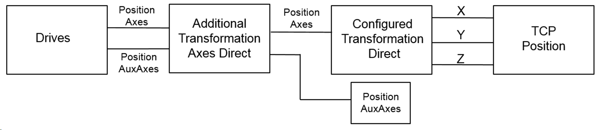

# IF\_AdditionalTransformationAxes - Direct (Method)

## Overview

|  |  |
| --- | --- |
| Type: | Method |
| Available as of: | V2.5.0.0 |

This chapter provides information on:

* [Task](#D-SE-0081015__D-SE-0081015.3)
* [Description](#D-SE-0081015__D-SE-0081015.4)
* [Interface](#D-SE-0081015__D-SE-0081015.5)
* [Diagnostic Messages](#D-SE-0081015__D-SE-0081015.6)
* [Example](#D-SE-0081015__D-SE-0081015.9)

## Task

Calculating the forward transformation for all axes.

## Description

With the method Direct(), the forward transformation of the additional user-defined transformation for all robot axes can be calculated. The inputs represent the current positions of the axes.



When a value unequal to zero for an unconfigured axis (q\_alrPositionAxis[…]) or auxiliary axis (q\_alrPositionAuxAx[…]) is calculated and transferred to the robot, the robot returns a diagnostic message.

* In case of axis, the diagnostic message ET\_Diag.ExecutionAborted / ET\_DiagExt.DriveNotConfigured is returned by the robot.
* In case of auxiliary axis, the diagnostic message ET\_Diag.ExecutionAborted / ET\_DiagExt.AuxiliaryAxisNotConfigured is returned by the robot.

## Interface

| Input | Data type | Description |
| --- | --- | --- |
| i\_alrPositionAxis | ARRAY [ET\_RobotComponent.AxisA .. ET\_RobotComponent.AxisAll +Gc\_udiMaxNumberOfAxes] OF LREAL | Position of robot axes |
| i\_alrPositionAuxAx | ARRAY [ET\_RobotComponent.AuxAx1.. ET\_RobotComponent.AuxAxAll +Gc\_udiMaxNumberOfAuxiliaryAxes] OF LREAL | Position of auxiliary axes |

| Output | Data type | Description |
| --- | --- | --- |
| q\_etDiag | [GD.ET\_Diag](../../../../../api/crossBook?lang=en-US&virtualBookName=PD.Lib.GlobalDiagnostic&topicID=D_SE_0076228) | General library-independent statement on the diagnostic.  A value not equal to ET\_Diag.Ok corresponds to a diagnostic message. |
| q\_etDiagExt | [ET\_DiagExt](ET_DiagExt-GeneralInformation-CAB158DC.html#ET_DiagExt-GeneralInformation-CAB158DC) | POU-specific output on the diagnostic.  q\_etDiag = ET\_Diag.Ok -> Status message  q\_etDiag <> ET\_Diag.Ok -> Diagnostic message |
| q\_sMsg | STRING[80] | Event-triggered message that gives additional information on the diagnostic state. |
| q\_alrPositionAxis | ARRAY [ET\_RobotComponent.AxisA .. ET\_RobotComponent.AxisAll +Gc\_udiMaxNumberOfAxes] OF LREAL | Position of robot axes |
| q\_alrPositionAuxAx | ARRAY [ET\_RobotComponent.AuxAx1.. ET\_RobotComponent.AuxAxAll +Gc\_udiMaxNumberOfAuxiliaryAxes] OF LREAL | Position of auxiliary axes |

## Diagnostic Messages

| q\_etDiag | q\_etDiagExt | Enumeration value | Description |
| --- | --- | --- | --- |
| ExecutionAborted | DriveNotConfigured | 65 | The drive is not configured. |
| ExecutionAborted | AuxiliaryAxisNotConfigured | 127 | The auxiliary axis is not configured. |

## AuxiliaryAxisNotConfigured

|  |  |
| --- | --- |
| Enumeration name: | AuxiliaryAxisNotConfigured |
| Enumeration value: | 127 |
| Description: | The auxiliary axis is not configured. |

| Issue | Cause | Solution |
| --- | --- | --- |
| Using additional transformation axes was not successful. | A position value unequal to zero of an unconfigured auxiliary axis is calculated and transferred to the robot. | Ensure that the position value zero is transferred to the not configured auxiliary axis. |

## DriveNotConfigured

|  |  |
| --- | --- |
| Enumeration name: | DriveNotConfigured |
| Enumeration value: | 65 |
| Description: | The drive is not configured. |

| Issue | Cause | Solution |
| --- | --- | --- |
| Using additional transformation axes was not successful. | A position value unequal to zero of an unconfigured robot axis is calculated and transferred to the robot. | Ensure that the position value zero is transferred to the not configured robot axes. |

## Implementation Example of Method Direct()

Declaration:

```
METHOD Direct
VAR_INPUT
  i_alrPositionAxis  : ARRAY [ROB.ET_RobotComponent.AxisA..
                       (ROB.ET_RobotComponent.AxisAll + 
                       ROB.Gc_udiMaxNumberOfAxes)] OF LREAL;
  i_alrPositionAuxAx : ARRAY [ROB.ET_RobotComponent.AuxAx1..
                       (ROB.ET_RobotComponent.AuxAxAll + 
                       ROB.Gc_udiMaxNumberOfAuxiliaryAxes)] OF LREAL;
END_VAR
VAR_OUTPUT
  q_etDiag           : GD.ET_Diag := GD.ET_Diag.Ok;
  q_etDiagExt        : ROB.ET_DiagExt := ROB.ET_DiagExt.Ok;
  q_sMsg             : STRING[80];
  q_alrPositionAxis  : ARRAY [ROB.ET_RobotComponent.AxisA..
                       (ROB.ET_RobotComponent.AxisAll + 
                       ROB.Gc_udiMaxNumberOfAxes)] OF LREAL;
  q_alrPositionAuxAx : ARRAY [ROB.ET_RobotComponent.AuxAx1..
                       (ROB.ET_RobotComponent.AuxAxAll + 
                       ROB.Gc_udiMaxNumberOfAuxiliaryAxes)] OF LREAL;
END_VAR
```

Implementation:

```
// Copy inputs to outputs first
q_alrPositionAxis   := i_alrPositionAxis;
q_alrPositionAuxAx  := i_alrPositionAuxAx;

// Implement additional transformation for robot axes here
// For example:
// q_alrPositionAxis[ROB.ET_RobotComponent.AxisB]   :=
     i_alrPositionAxis   [ROB.ET_RobotComponent.AxisB] - 90.0;
// q_alrPositionAuxAx[ROB.ET_RobotComponent.AuxAx3] := 
     i_alrPositionAuxAx[ROB.ET_RobotComponent.AuxAx1] + 
     i_alrPositionAuxAx[ROB.ET_RobotComponent.AuxAx2];
```

EIO0000002232.23