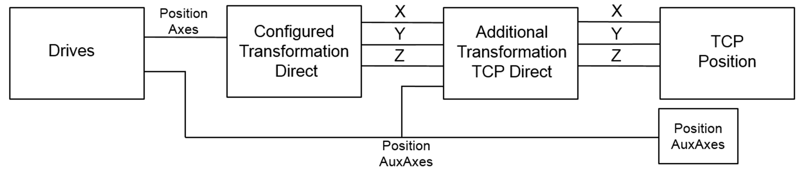
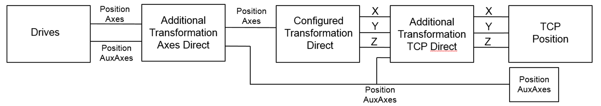

# IF\_AdditionalTransformationTCP - Direct (Method)

## Overview

|  |  |
| --- | --- |
| Type | Method |
| Available as of: | V2.6.1.0 |

This chapter provides information on:

* [Task](#D-SE-0081141__D-SE-0081141.3)
* [Description](#D-SE-0081141__D-SE-0081141.4)
* [Interface](#D-SE-0081141__D-SE-0081141.5)
* [Example](#D-SE-0081141__D-SE-0081141.6)

## Task

Calculating the forward transformation of the additional user-defined transformation for the TCP (Tool Center Point).

## Description

With the method Direct(), the forward transformation of the additional user-defined transformation for the TCP (Tool Center Point) can be calculated. The inputs represent the current positions of the TCP and the auxiliary axes.



When a value unequal to zero for an unconfigured TCP component (q\_stPositionTCP.lrX / lrY / lrZ) is calculated and transferred to the robot, the robot returns the diagnostic message ET\_Diag.ExecutionAborted / ET\_DiagExt.ComponentNotConfigured.

In case AdditionalTransformationAxes(…) is also configured, the data flow is as follows.



## Interface

| Input | Data type | Description |
| --- | --- | --- |
| i\_stPositionTCP | PDL.ST\_Vector3D | Position of TCP. |
| i\_alrPositionAuxAx | ARRAY [ET\_RobotComponent.AuxAx1 .. ET\_RobotComponent.AuxAxAll + Gc\_udiMaxNumberOfAuxiliaryAxes] OF LREAL | Position of auxiliary axes. |
| i\_xChange | BOOL | TRUE: A change of the additional transformation TCP was requested. The change must be done for the Direct and Inverse transformation at the same time.  FALSE: No change of the additional transformation TCP was requested. |

| Output | Data type | Description |
| --- | --- | --- |
| q\_etDiag | [GD.ET\_Diag](../../../../../api/crossBook?lang=en-US&virtualBookName=PD.Lib.GlobalDiagnostic&topicID=D_SE_0076228) | General, library-independent statement on the diagnostic.  A value not equal to ET\_Diag.Ok corresponds to a diagnostic message. |
| q\_etDiagExt | [ET\_DiagExt](ET_DiagExt-GeneralInformation-CAB158DC.html#ET_DiagExt-GeneralInformation-CAB158DC) | POU-specific output for the diagnostic.  q\_etDiag = ET\_Diag.Ok -> Status message  q\_etDiag <> ET\_Diag.Ok -> Diagnostic message |
| q\_sMsg | STRING[80] | Event-triggered message that gives additional information on the diagnostic state. |
| q\_stPositionTCP | PDL.ST\_Vector3D | Position of TCP. |

## Implementation Example of Method Direct()

Declaration:

```
METHOD Direct
VAR_INPUT
  i_stPositionTCP    : PDL.ST_Vector3D..
  i_alrPositionAuxAx : ARRAY [ROB.ET_RobotComponent.AuxAx1..
                       (ROB.ET_RobotComponent.AuxAxAll + 
                       ROB.Gc_udiMaxNumberOfAuxiliaryAxes)] OF LREAL;
  i_xChange          : BOOL;
END_VAR
VAR_OUTPUT
  q_etDiag           : GD.ET_Diag := GD.ET_Diag.Ok;
  q_etDiagExt        : ROB.ET_DiagExt := ROB.ET_DiagExt.Ok;
  q_sMsg             : STRING[80];
  q_stPositionTCP    : PDL.ST_Vector3D;
END_VAR
```

Implementation:

```
// Copy inputs to outputs first
q_stPositionTCP   := i_stPositionTCP;

// Implement additional transformation for robot axes here
// For example:
// q_stPositionTCP.lrZ := i_stPositionTCP.lrZ - 50.0;
```

EIO0000002232.23