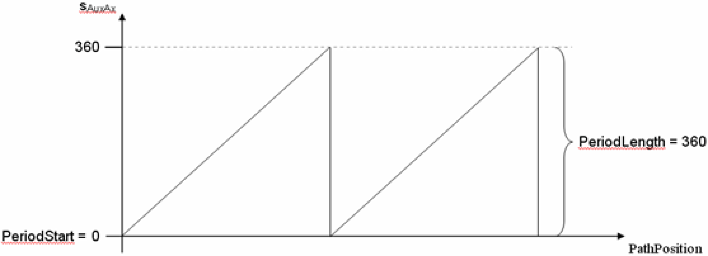
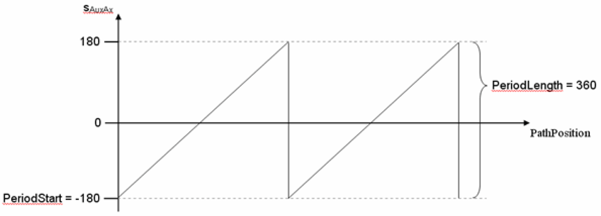

# IF\_RobotConfiguration - AddAuxAx (Method)

## Overview

|  |  |
| --- | --- |
| Type: | Method |
| Available as of: | V1.0.0.0 |

This chapter provides information on:

* [Task](#D-SE-0075521__D-SE-0075521.3)
* [Description](#D-SE-0075521__D-SE-0075521.4)
* [Interface](#D-SE-0075521__D-SE-0075521.5)
* [Return Value](#D-SE-0075521__D-SE-0075521.6)
* [Diagnostic Messages](#D-SE-0075521__D-SE-0075521.7)

## Task

Adding an auxiliary axis to the robot.

## Description

With the method AddAuxAx(...), an auxiliary axis can be added to the robot.

Optionally a period can be defined in which the auxiliary axis moves.

## Interface

| Input | Data type | Description |
| --- | --- | --- |
| i\_ifDrive | [SystemConfigurationItf.IF\_Drive](../../../../../api/crossBook?lang=en-US&virtualBookName=PD.Lib.SystemConfigurationItf&topicID=D_SE_0089154)  For Modicon M262/M660 Motion Controllers, the data type is CMI.IF\_AxisIdentification. | Drive that shall be configured as an auxiliary axis. |
| i\_lrPeriodStart | LREAL | Position of the auxiliary axis where the period starts. |
| i\_lrPeriodLength | LREAL | Length of the auxiliary axis period.  Value range: i\_lrPeriodLength ≥ 0.0  i\_lrPeriodLength = 0.0 -> The auxiliary axis does not have a period. The value entered in i\_lrPeriodStart is ignored. |

| Output | Data type | Description |
| --- | --- | --- |
| q\_etDiag | [GD.ET\_Diag](../../../../../api/crossBook?lang=en-US&virtualBookName=PD.Lib.GlobalDiagnostic&topicID=D_SE_0076228) | General library-independent statement on the diagnostic.  A value unequal to GD.ET\_Diag.Ok corresponds to a diagnostic message. |
| q\_etDiagExt | [ET\_DiagExt](ET_DiagExt-GeneralInformation-CAB158DC.html#ET_DiagExt-GeneralInformation-CAB158DC) | POU-specific output on the diagnostic.  q\_etDiag = GD.ET\_Diag.Ok -> status message  q\_etDiag <> GD.ET\_Diag.Ok -> diagnostic message |
| q\_sMsg | STRING[80] | Event-triggered message that gives additional information on the diagnostic state. |

## Return Value

| Data type | Description |
| --- | --- |
| [ET\_RobotComponent](D-SE-0075489.html#D-SE-0075489) | Number of the added auxiliary axis |

## Diagnostic Messages

| q\_etDiag | q\_etDiagExt | Enumeration value | Description |
| --- | --- | --- | --- |
| OK | Ok | 0 | Ok |
| ExecutionAborted | ConfigurationAlreadyCompleted | 105 | The configuration is already completed. |
| ExecutionAborted | NoMoreAuxAxAvailable | 34 | There are no more AuxAx available. |
| InputParameterInvalid | DriveAlreadyInUse | 35 | The drive is already in use. |
| InputParameterInvalid | DriveInvalid | 92 | The drive is invalid. |
| InputParameterInvalid | PeriodLengthRange | 99 | The period length is out of range. |

## ConfigurationAlreadyCompleted

|  |  |
| --- | --- |
| Enumeration name: | ConfigurationAlreadyCompleted |
| Enumeration value: | 105 |
| Description: | The configuration is already completed. |

| Issue | Cause | Solution |
| --- | --- | --- |
| The configuration of the auxiliary axis was not successful. | The configuration of the robot has already been completed. The method ConfigDone(...) has already been called up successfully. | Ensure that no transformation configuration method, for example Delta3Ax(...) or AddAuxAx(...), is called after the configuration has been completed. |

## DriveAlreadyInUse

|  |  |
| --- | --- |
| Enumeration name: | DriveAlreadyInUse |
| Enumeration value: | 35 |
| Description: | The drive is already in use. |

| Issue | Cause | Solution |
| --- | --- | --- |
| The configuration of the auxiliary axis was not successful. | The drive transferred at the input i\_ifDrive is already configured in the robot and cannot be used again. | Ensure that no drive is assigned to the robot more than once. |

## DriveInvalid

|  |  |
| --- | --- |
| Enumeration name: | DriveInvalid |
| Enumeration value: | 92 |
| Description: | The drive is invalid. |

| Issue | Cause | Solution |
| --- | --- | --- |
| The configuration of the auxiliary axis was not successful. | The drive that was transferred to the input i\_ifDrive is invalid. | Ensure that a valid drive is transferred to the input i\_ifDrive. |

## NoMoreAuxAxAvailable

|  |  |
| --- | --- |
| Enumeration name: | NoMoreAuxAxAvailable |
| Enumeration value: | 34 |
| Description: | There are no more AuxAx available. |

| Issue | Cause | Solution |
| --- | --- | --- |
| The configuration of the auxiliary axis was not successful. | No more auxiliary axes of the robot can be configured. | The maximum number of configurable auxiliary axes is Gc\_udiMaxNumberOfAuxiliaryAxes. |

## Ok

|  |  |
| --- | --- |
| Enumeration name: | Ok |
| Enumeration value: | 0 |
| Description: | Ok |

The configuration of the auxiliary axis was successful.

## PeriodLengthRange

|  |  |
| --- | --- |
| Enumeration name: | PeriodLengthRange |
| Enumeration value: | 99 |
| Description: | The period length is out of range. |

| Issue | Cause | Solution |
| --- | --- | --- |
| The configuration of the auxiliary axis was not successful. | The value transferred at the input i\_lrPeriodLength is outside the valid range. | At the input i\_lrPeriodLength, a value greater than or equal to 0 must be transferred. |

EIO0000002232.23