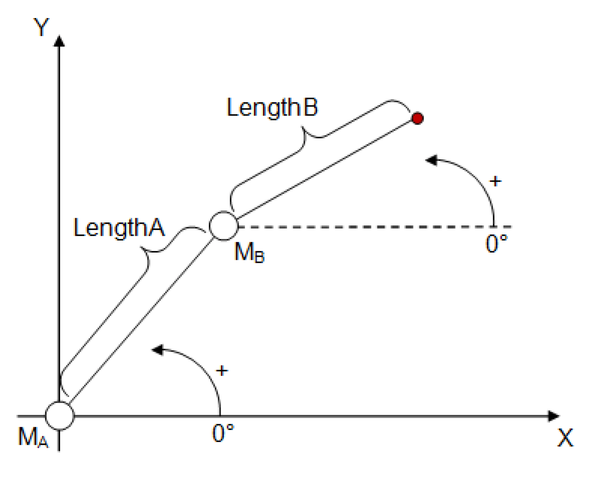

# IF\_RobotConfiguration - Articulated2Ax (Method)

## Overview

|  |  |
| --- | --- |
| Type: | Method |
| Available as of: | V1.4.1.0 |

This chapter provides information on:

* [Task](#D-SE-0075516__D-SE-0075516.3)
* [Description](#D-SE-0075516__D-SE-0075516.4)
* [Interface](#D-SE-0075516__D-SE-0075516.5)
* [Diagnostic Messages](#D-SE-0075516__D-SE-0075516.6)

NOTE: Using the transformation Articulated2Ax requires license points.

License points are only required for library versions earlier than V2.6.1.0. For more information on license points, refer to *License Model for PacDrive Software Packages*.

Number of license points: 25

License string: ROB.Articul2Ax

The license points are requested during a successful call of the configuration method.

## Task

Configuring a biaxial Articulated robot.

## Description

With the method Articulated2Ax(...), the robot can be configured as a biaxial Articulated robot with two degrees of freedom.

NOTE: If a method to configure a transformation was already called up successfully (q\_etDiag = GD.ET\_Diag.Ok AND q\_etDiagExt = ET\_DiagExt.Ok), then it is not possible to overwrite the parameterization by calling up another method to configure a transformation.

## Interface

| Input | Data type | Description |
| --- | --- | --- |
| i\_ifDriveA | [SystemConfigurationItf.IF\_Drive](../../../../../api/crossBook?lang=en-US&virtualBookName=PD.Lib.SystemConfigurationItf&topicID=D_SE_0089154)  For Modicon M262/M660 Motion Controllers, the data type is CMI.IF\_AxisIdentification. | Drive of axis A. |
| i\_ifDriveB | [SystemConfigurationItf.IF\_Drive](../../../../../api/crossBook?lang=en-US&virtualBookName=PD.Lib.SystemConfigurationItf&topicID=D_SE_0089154)  For Modicon M262/M660 Motion Controllers, the data type is CMI.IF\_AxisIdentification. | Drive of axis B. |
| i\_etPlane | [ET\_WorkingPlane](D-SE-0075495.html#D-SE-0075495) | Specification in which working plane the robot is operating. |
| i\_lrLengthA | LREAL | Length of the robot arm A.  Value range: i\_lrLengthA > 0.0 |
| i\_lrLengthB | LREAL | Length of the robot arm B.  Value range: i\_lrLengthB > 0.0 |

| Output | Data type | Description |
| --- | --- | --- |
| q\_etDiag | [GD.ET\_Diag](../../../../../api/crossBook?lang=en-US&virtualBookName=PD.Lib.GlobalDiagnostic&topicID=D_SE_0076228) | General library-independent statement on the diagnostic.  A value not equal to GD.ET\_Diag.Ok corresponds to a diagnostic message. |
| q\_etDiagExt | [ET\_DiagExt](ET_DiagExt-GeneralInformation-CAB158DC.html#ET_DiagExt-GeneralInformation-CAB158DC) | POU-specific output on the diagnostic.  q\_etDiag = ET\_Diag.Ok -> Status message  q\_etDiag <> ET\_Diag.Ok -> Diagnostic message |
| q\_sMsg | STRING[80] | Event-triggered message that gives additional information on the diagnostic state. |

## Diagnostic Messages

| q\_etDiag | q\_etDiagExt | Enumeration value | Description |
| --- | --- | --- | --- |
| OK | Ok | 0 | Ok |
| ExecutionAborted | ConfigurationAlreadyCompleted | 105 | The configuration is already completed. |
| ExecutionAborted | TransformationAlreadyConfigured | 106 | The transformation is already configured. |
| InputParameterInvalid | DriveAAlreadyInUse | 36 | The drive A is already in use. |
| InputParameterInvalid | DriveAInvalid | 48 | The drive A is invalid. |
| InputParameterInvalid | DriveBAlreadyInUse | 37 | The drive B is already in use. |
| InputParameterInvalid | DriveBInvalid | 49 | The drive B is invalid. |
| InputParameterInvalid | LengthARange | 160 | The LengthA is out of range. |
| InputParameterInvalid | LengthBRange | 161 | The LengthB is out of range. |
| InputParameterInvalid | PlaneInvalid | 107 | The plane is invalid. |

## ConfigurationAlreadyCompleted

|  |  |
| --- | --- |
| Enumeration name: | ConfigurationAlreadyCompleted |
| Enumeration value: | 105 |
| Description: | The configuration is already completed. |

| Issue | Cause | Solution |
| --- | --- | --- |
| The configuration of the robot transformation was not successful. | The configuration of the robot has already been completed. The method ConfigDone(...) has already been called up successfully. | Ensure that no transformation configuration method, for example Delta3Ax(...) or AddAuxAx(...), is called after the configuration has been completed. |

## DriveAAlreadyInUse

|  |  |
| --- | --- |
| Enumeration name: | DriveAAlreadyInUse |
| Enumeration value: | 36 |
| Description: | The drive A is already in use. |

| Issue | Cause | Solution |
| --- | --- | --- |
| The configuration of the robot transformation was not successful. | The drive transferred at the input i\_ifDriveA is already configured in the robot and cannot be used again. | Ensure that no drive is assigned to the robot more than once. |

## DriveAInvalid

|  |  |
| --- | --- |
| Enumeration name: | DriveAInvalid |
| Enumeration value: | 48 |
| Description: | The drive A is invalid. |

| Issue | Cause | Solution |
| --- | --- | --- |
| The configuration of the robot transformation was not successful. | The drive transferred at the input i\_ifDriveA is invalid. | At the input i\_ifDriveA, a valid drive must be transferred. |

## DriveBAlreadyInUse

|  |  |
| --- | --- |
| Enumeration name: | DriveBAlreadyInUse |
| Enumeration value: | 37 |
| Description: | The drive B is already in use. |

| Issue | Cause | Solution |
| --- | --- | --- |
| The configuration of the robot transformation was not successful. | The drive transferred at the input i\_ifDriveB is already configured in the robot and cannot be used again. | Ensure that no drive is assigned to the robot more than once. |

## DriveBInvalid

|  |  |
| --- | --- |
| Enumeration name: | DriveBInvalid |
| Enumeration value: | 49 |
| Description: | The drive B is invalid. |

| Issue | Cause | Solution |
| --- | --- | --- |
| The configuration of the robot transformation was not successful. | The drive transferred at the input i\_ifDriveB is invalid. | At the input i\_ifDriveB, a valid drive must be transferred. |

## LengthARange

|  |  |
| --- | --- |
| Enumeration name: | LengthARange |
| Enumeration value: | 160 |
| Description: | The LengthA is out of range. |

| Issue | Cause | Solution |
| --- | --- | --- |
| The configuration of the robot transformation was not successful. | The value transferred at the input i\_IrLengthA lies outside the valid range. | At the input i\_lrLengthA, a value greater than 0.0 must be transferred. |

## LengthBRange

|  |  |
| --- | --- |
| Enumeration name: | LengthBRange |
| Enumeration value: | 161 |
| Description: | The LengthB is out of range. |

| Issue | Cause | Solution |
| --- | --- | --- |
| The configuration of the robot transformation was not successful. | The value transferred at the input i\_IrLengthB lies outside the valid range. | At the input i\_lrLengthB, a value greater than 0.0 must be transferred. |

## Ok

|  |  |
| --- | --- |
| Enumeration name: | Ok |
| Enumeration value: | 0 |
| Description: | Ok |

The configuration of the robot transformation was successful.

## PlaneInvalid

|  |  |
| --- | --- |
| Enumeration name: | PlaneInvalid |
| Enumeration value: | 107 |
| Description: | The plane is invalid. |

| Issue | Cause | Solution |
| --- | --- | --- |
| The configuration of the robot transformation was not successful. | The value transferred at the input i\_etPlane is invalid. | At the input i\_etPlane, a value contained in ET\_WorkingPlane must be transferred. |

## TransformationAlreadyConfigured

|  |  |
| --- | --- |
| Enumeration name: | TransformationAlreadyConfigured |
| Enumeration value: | 106 |
| Description: | The transformation is already configured. |

| Issue | Cause | Solution |
| --- | --- | --- |
| The configuration of the robot transformation was not successful. | The configuration of the robot transformation has already been completed successfully. | Ensure that a configuration for a transformation is only called once. |

EIO0000002232.23